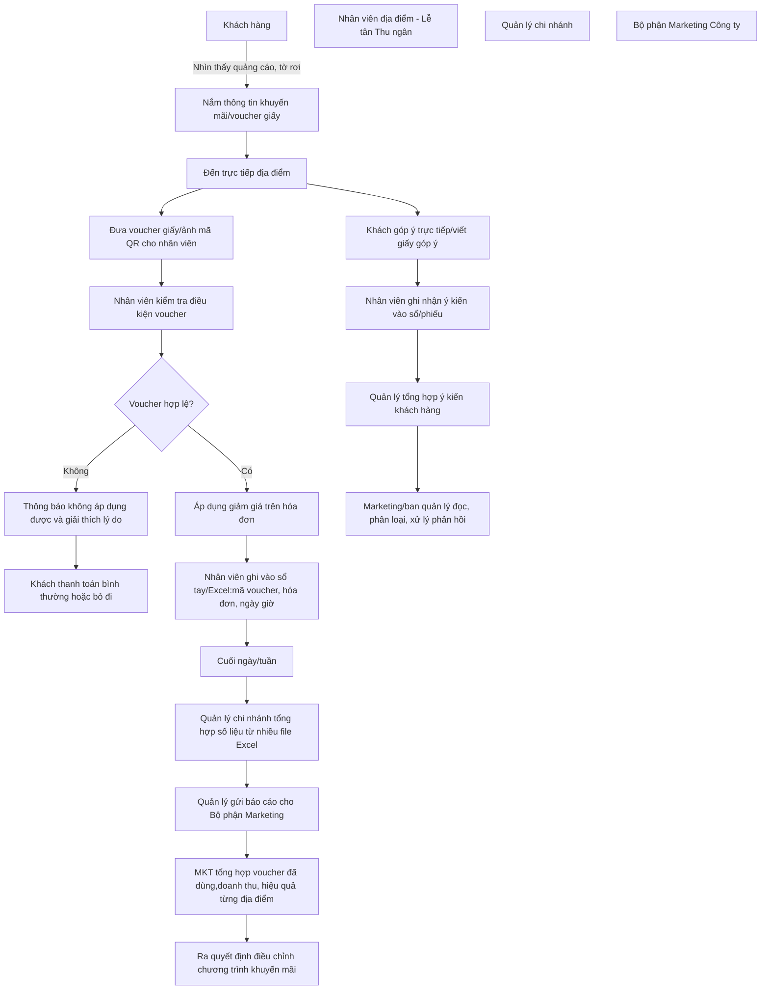
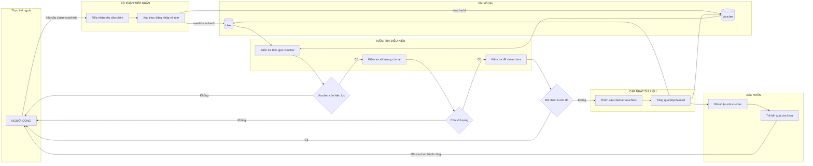
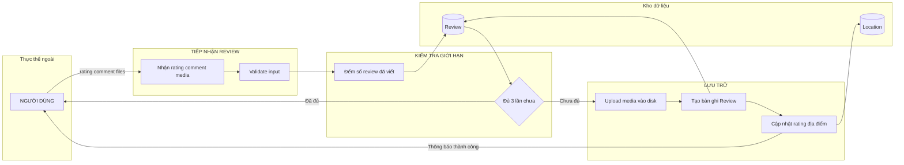
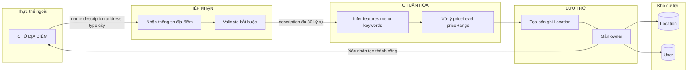
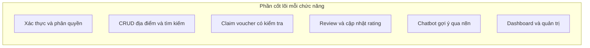
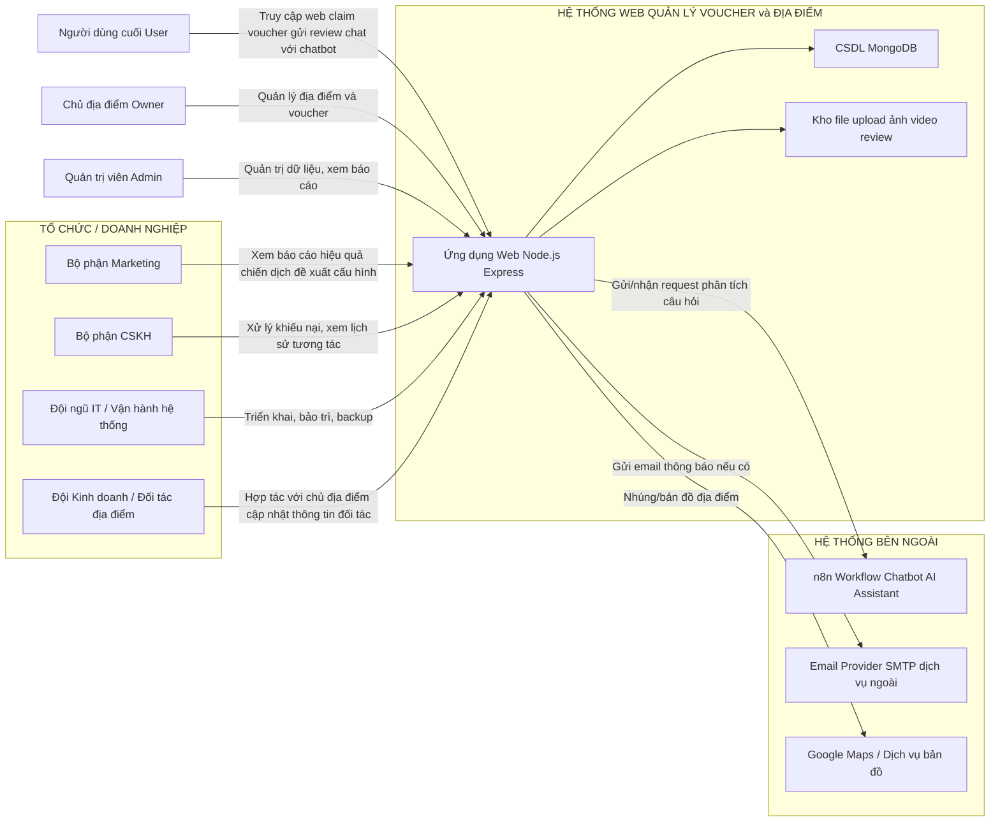
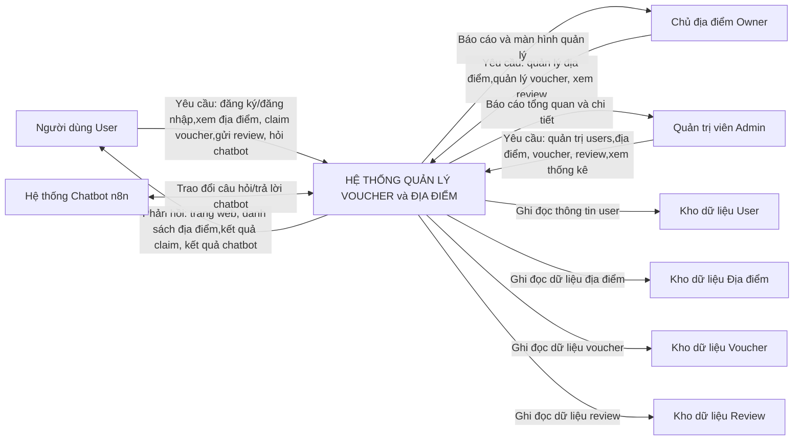
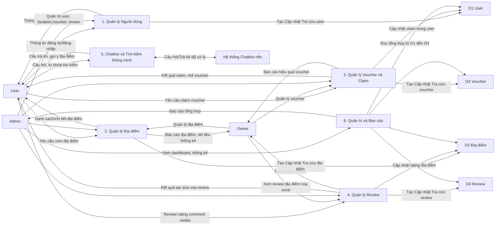
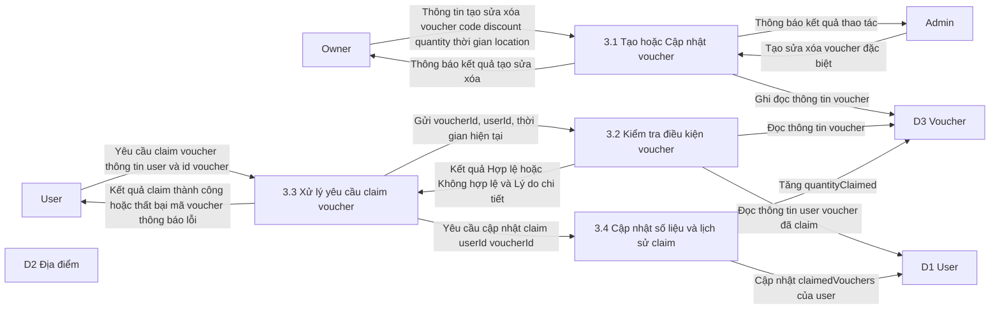

# PHÂN TÍCH HỆ THỐNG THEO DFD & PHÂN RÃ CHỨC NĂNG

Hệ thống hiện tại là một **nền tảng web quản lý địa điểm, voucher và review** cho phép:

- Người dùng (User) duyệt địa điểm, claim voucher, viết đánh giá.
- Chủ địa điểm (Owner) quản lý địa điểm/voucher của mình.
- Quản trị viên (Admin) giám sát, kiểm duyệt và quản lý dữ liệu toàn hệ thống.

Tài liệu này tập trung **nhìn hệ thống dưới góc độ phân tích nghiệp vụ cổ điển**: 

- Lưu đồ hệ thống thủ công (chưa có phần mềm).
- Sơ đồ phân rã chức năng.
- Sơ đồ dòng chảy dữ liệu (DFD) theo các mức: ngữ cảnh (mức 0), mức 1 và mức 2.
- Chỉ ra mối liên hệ giữa hệ thống với tổ chức và các hệ thống bên ngoài.

---

## 1. Lưu đồ hệ thống thủ công (chưa có phần mềm)

Giả sử trước khi xây dựng hệ thống, doanh nghiệp vận hành chương trình voucher và thu thập phản hồi **bằng cách thủ công** (giấy tờ, Excel, gọi điện, v.v.).



**Nhận xét**:
- Nhiều bước **thủ công**, phụ thuộc vào giấy tờ/Excel rời rạc.
- Dữ liệu phân tán, **khó thống kê theo thời gian thực**.
- Khó truy vết chi tiết từng khách hàng/voucher, dễ sai sót khi tổng hợp.

### 1.2. Lưu đồ chi tiết DFD – Luồng Claim Voucher

Học theo mẫu DFD xử lý đơn hàng, vẽ lại luồng **claim voucher** của project với các bộ phận chức năng, kho dữ liệu và điểm quyết định.

| Ký hiệu | Ý nghĩa |
|---------|---------|
| Hình chữ nhật bo góc | Tiến trình xử lý |
| Hình thoi | Điểm quyết định |
| Hình bình hành | Tài liệu / dữ liệu vào ra |
| Hình chữ nhật mở | Kho dữ liệu |



**Tài liệu / dữ liệu luân chuyển:**

| Từ | Đến | Nội dung |
|----|-----|----------|
| User | Bộ phận tiếp nhận | Yêu cầu claim voucherId |
| Kho User | Kiểm tra | userId, claimedVouchers |
| Kho Voucher | Kiểm tra | startDate, endDate, quantityClaimed, quantityTotal |
| Cập nhật | Kho User | Thêm bản ghi claimedVouchers |
| Cập nhật | Kho Voucher | Tăng quantityClaimed |
| Xác nhận | User | Mã voucher, thông báo thành công |

---

### 1.3. Lưu đồ chi tiết DFD – Luồng Viết Review



**Tài liệu / dữ liệu luân chuyển:**

| Từ | Đến | Nội dung |
|----|-----|----------|
| User | Tiếp nhận | rating 1-5, comment, media files |
| Kho Review | Kiểm tra | count user location |
| Lưu trữ | Kho Review | user, location, rating, comment, media |
| Lưu trữ | Kho Location | rating trung bình mới |
| Kết quả | User | Thông báo tạo review thành công |

---

### 1.4. Lưu đồ chi tiết DFD – Luồng Owner Tạo Địa Điểm



**Tài liệu / dữ liệu luân chuyển:**

| Từ | Đến | Nội dung |
|----|-----|----------|
| Owner | Tiếp nhận | name, description, address, type, city, priceRange |
| Chuẩn hóa | Lưu trữ | features, menuHighlights, keywords, priceLevel |
| Lưu trữ | Kho Location | Bản ghi Location mới |
| Lưu trữ | Kho User | owner = userId |
| Kết quả | Owner | Thông báo tạo địa điểm thành công |

---

## 2. Sơ đồ phân rã chức năng (Function Decomposition)

Ở mức cao nhất, hệ thống được xem như **một chức năng tổng quát**:

> HỆ THỐNG QUẢN LÝ VOUCHER, ĐỊA ĐIỂM VÀ ĐÁNH GIÁ KHÁCH HÀNG

Sơ đồ phân rã chức năng thể hiện **cây chức năng** từ tổng quát đến chi tiết.

```mermaid
flowchart TD
    ROOT[HỆ THỐNG QUẢN LÝ VOUCHER và ĐỊA ĐIỂM]
    F1[1. Quản lý tài khoản và phân quyền]
    F2[2. Quản lý địa điểm]
    F3[3. Quản lý voucher]
    F4[4. Quản lý review và phản hồi]
    F5[5. Chatbot và hỗ trợ tìm kiếm thông minh]
    F6[6. Quản trị và báo cáo hệ thống]
    ROOT --> F1
    ROOT --> F2
    ROOT --> F3
    ROOT --> F4
    ROOT --> F5
    ROOT --> F6
    F1 --> F1a[1.1 Đăng ký đăng nhập đăng xuất]
    F1 --> F1b[1.2 Quản lý hồ sơ cá nhân]
    F1 --> F1c[1.3 Phân quyền User Owner Admin]
    F2 --> F2a[2.1 Tạo Sửa Xóa địa điểm]
    F2 --> F2b[2.2 Lưu trữ metadata]
    F2 --> F2c[2.3 Tìm kiếm và lọc địa điểm]
    F3 --> F3a[3.1 Tạo Sửa Xóa voucher]
    F3 --> F3b[3.2 Quản lý số lượng và thời gian]
    F3 --> F3c[3.3 Cho phép User claim voucher]
    F4 --> F4a[4.1 User viết review]
    F4 --> F4b[4.2 Giới hạn số lần review]
    F4 --> F4c[4.3 Cập nhật rating địa điểm]
    F5 --> F5a[5.1 Nhận câu hỏi từ người dùng]
    F5 --> F5b[5.2 Gửi yêu cầu tới n8n Workflow]
    F6 --> F6a[6.1 Dashboard quản trị]
    F6 --> F6b[6.2 Thống kê hệ thống]
```



**Ghi chú**:
- Sơ đồ trên là **cây chức năng logic**, không phải sơ đồ module code.
- Từng nhánh có thể tiếp tục phân rã chi tiết hơn (ví dụ 3.3 claim voucher → kiểm tra điều kiện, cập nhật user, cập nhật voucher, ghi log,...).

### 2.1. Phần quan trọng nhất của mỗi chức năng

| Chức năng | Phần quan trọng nhất |
|-----------|----------------------|
| **1. Quản lý tài khoản và phân quyền** | Xác thực đăng nhập, phân quyền User / Owner / Admin |
| **2. Quản lý địa điểm** | CRUD địa điểm, tìm kiếm và lọc theo loại/giá |
| **3. Quản lý voucher** | User claim voucher, kiểm tra điều kiện và số lượng |
| **4. Quản lý review và phản hồi** | User viết review kèm media, cập nhật rating địa điểm tự động |
| **5. Chatbot và tìm kiếm thông minh** | Nhận câu hỏi, gửi n8n, gợi ý địa điểm kèm link |
| **6. Quản trị và báo cáo** | Dashboard thống kê, quản lý user/location/voucher/review |



### 2.2. Hiện thực phần quan trọng trong codebase

| Chức năng | Route / API | Controller | Model | Logic chính |
|-----------|-------------|------------|-------|-------------|
| **1. Xác thực và phân quyền** | `POST /login`, `POST /register`, `POST /logout` | `user.controller` | `User` | `login`, `register`, middleware `requireAuth`, `requireAdmin`, `requireOwner` |
| **2. CRUD địa điểm và tìm kiếm** | `GET /locations`, `GET /locations/:id`, `POST /owner/locations`, `PUT /owner/locations/:id` | `location.controller` | `Location` | `getAllLocations` (text search) `createLocation`, `updateLocation`, `deleteLocation` |
| **3. Claim voucher có kiểm tra** | `POST /vouchers/:voucherId/claim` | `voucher.controller` | `Voucher`, `User` | `claimVoucher` kiểm tra thời gian, số lượng, tránh claim trùng |
| **4. Review và cập nhật rating** | `POST /locations/:locationId/reviews` | `review.controller` | `Review`, `Location` | `createReview` upload media, giới hạn 3 review/user/location, cập nhật `location.rating` |
| **5. Chatbot gợi ý qua n8n** | `POST /api/chatbot/query` | `chatbot.routes` | - | Gọi n8n webhook, `linkifyLocations` trong câu trả lời |
| **6. Dashboard và quản trị** | `GET /admin/dashboard`, `/admin/users`, `/admin/locations`, `/admin/vouchers`, `/admin/reviews` | `admin.routes`, `review.controller` | `User`, `Location`, `Voucher`, `Review` | Thống kê, CRUD user/location/voucher/review |

**Cấu trúc file hiện thực:**

```
src/
├── routes/
│   ├── user.routes.js      → 1. Xác thực, đăng ký, đăng nhập
│   ├── location.routes.js  → 2. CRUD địa điểm, 4. Tạo review
│   ├── voucher.routes.js   → 3. Claim voucher, CRUD voucher
│   ├── chatbot.routes.js   → 5. Chatbot query
│   └── admin.routes.js     → 6. Dashboard, quản trị
├── controllers/
│   ├── user.controller.js
│   ├── location.controller.js
│   ├── voucher.controller.js
│   ├── review.controller.js
│   └── owner.controller.js
├── middleware/
│   └── auth.js             → requireAuth, requireAdmin, requireOwner
└── models/
    ├── user.model.js
    ├── location.model.js
    ├── voucher.model.js
    └── review.model.js
```

---

## 3. Mối liên hệ với tổ chức & hệ thống bên ngoài

Phần này mô tả **hệ sinh thái xung quanh hệ thống**: các phòng ban trong tổ chức, các tác nhân bên ngoài và hệ thống tích hợp.



---

## 4. Sơ đồ dòng chảy dữ liệu (DFD) – Mức ngữ cảnh (Level 0)

Ở **mức ngữ cảnh (Level 0)**, hệ thống được xem như **một tiến trình duy nhất**: “Hệ thống quản lý voucher & địa điểm”. Các tác nhân bên ngoài gửi yêu cầu và nhận kết quả, dữ liệu được lưu trong các kho dữ liệu chính.



---

## 5. DFD Mức 1 – Phân rã các tiến trình chính

Ở **mức 1**, tiến trình tổng `HỆ THỐNG QUẢN LÝ VOUCHER & ĐỊA ĐIỂM` được phân rã thành các nhóm xử lý chính:

1. Quản lý người dùng & phân quyền.
2. Quản lý địa điểm.
3. Quản lý voucher & claim.
4. Quản lý review.
5. Chatbot & tìm kiếm thông minh.
6. Quản trị & báo cáo.



---

## 6. DFD Mức 2 – Phân rã tiến trình “3. Quản lý Voucher & Claim”

Tiến trình `3. Quản lý Voucher & Claim` là một trong các nghiệp vụ quan trọng nhất của hệ thống, được phân rã chi tiết hơn ở **mức 2**.



**Diễn giải các tiến trình mức 2**:
- **P3.1 Tạo/Cập nhật voucher**: nhận thông tin từ Owner/Admin, kiểm tra trùng mã, validate thời gian và số lượng, sau đó lưu vào `D3: Voucher`.
- **P3.2 Kiểm tra điều kiện voucher**: đọc `D3: Voucher` và `D1: User` để đảm bảo voucher còn hiệu lực, còn số lượng, user chưa claim trước đó,...
- **P3.3 Xử lý yêu cầu claim voucher**: là trung tâm tiếp nhận yêu cầu claim từ User, gọi P3.2 để kiểm tra, nếu pass thì yêu cầu P3.4 cập nhật dữ liệu; sau đó gửi kết quả lại cho User.
- **P3.4 Cập nhật số liệu & lịch sử claim**: ghi nhận claim vào `claimedVouchers` của user và cập nhật `quantityClaimed` của voucher, phục vụ cho các báo cáo sau này.

---

## 7. Gợi ý DFD Mức 2 cho các tiến trình khác

Tùy yêu cầu đồ án, bạn có thể **vẽ thêm DFD mức 2** cho các tiến trình quan trọng khác. Ví dụ:

- **Tiến trình 2. Quản lý Địa điểm**:
  - 2.1 Tiếp nhận thông tin địa điểm mới.
  - 2.2 Chuẩn hóa & làm giàu metadata (giá, city, features, menu, keywords).
  - 2.3 Lưu địa điểm & cập nhật chỉ mục tìm kiếm.
  - 2.4 Phục vụ tra cứu & hiển thị danh sách/chi tiết.

- **Tiến trình 4. Quản lý Review**:
  - 4.1 Kiểm tra quyền và giới hạn số review.
  - 4.2 Xử lý upload media & lưu file.
  - 4.3 Lưu review & cập nhật rating địa điểm.
  - 4.4 Xóa review & dọn dẹp file media.

Việc phân rã sâu hơn nên **bám sát logic đã triển khai trong code** (controllers, models) để đảm bảo tài liệu phân tích thống nhất với hệ thống thực tế.