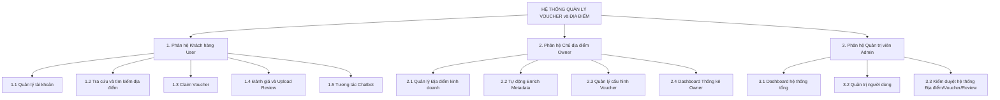
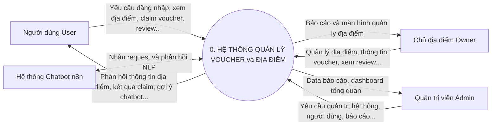
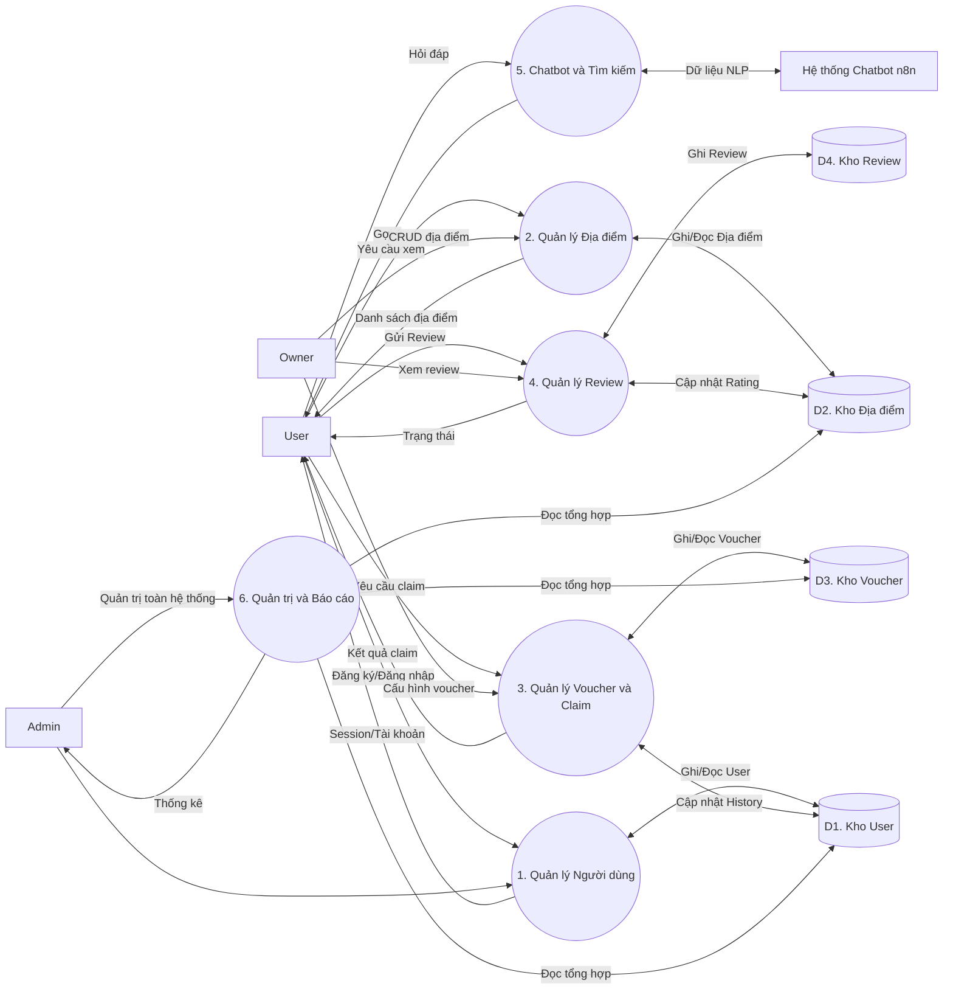
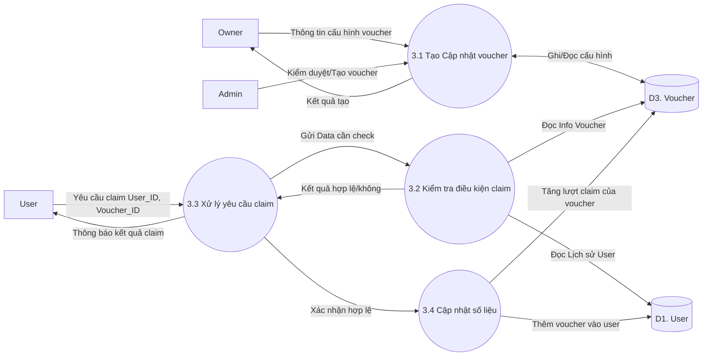
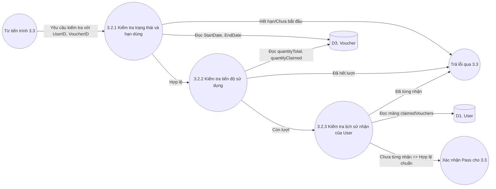

# PHÂN TÍCH VÀ THIẾT KẾ HỆ THỐNG THÔNG TIN
**Dự án: Nền tảng Quản lý Voucher và Địa điểm Du lịch (Voucher Management System)**

---

## CHƯƠNG 1: TỔNG QUAN DỰ ÁN VÀ KHẢO SÁT HIỆN TRẠNG

### 1.1. Bối cảnh và mục tiêu dự án
Trong giai đoạn chuyển đổi số, các doanh nghiệp dịch vụ (nhà hàng, quán ăn, điểm du lịch) ngày càng phụ thuộc vào các nền tảng trực tuyến để quảng bá dịch vụ phục vụ khách hàng. Quản lý khuyến mãi, voucher và thu thập phản hồi khách hàng là nhu cầu cấp thiết, nhưng nhiều doanh nghiệp nhỏ lẻ vẫn chưa có công cụ hỗ trợ toàn diện.

**Mục tiêu dự án:**
Xây dựng một nền tảng quản lý voucher và địa điểm hoàn chỉnh nhằm mục đích:
- Cung cấp giải pháp cho tổ chức/doanh nghiệp phát hành, quản lý voucher và thu thập review.
- Tạo một cổng thông tin giúp người dùng (khách hàng) dễ dàng tìm kiếm địa điểm, nhận ưu đãi và chia sẻ trải nghiệm.
- Xây dựng công cụ quản trị tập trung (dashboard) giúp theo dõi hiệu quả hoạt động kinh doanh.

### 1.2. Khảo sát hiện trạng hệ thống cũ (Quy trình thủ công)
Trước khi hệ thống được áp dụng, quy trình quản lý sử dụng phương pháp thủ công dựa trên giấy tờ và MS Excel:
1. Doanh nghiệp phát hành voucher giấy hoặc hình ảnh mã QR.
2. Khách hàng tới địa điểm, đưa voucher cho nhân viên thu ngân/lễ tân.
3. Nhân viên kiểm tra tính hợp lệ bằng tay (còn hạn không, áp dụng được không). Nếu hợp lệ mới tiến hành giảm giá.
4. Nhân viên ghi chép tay hoặc nhập Excel số liệu mã voucher, số hóa đơn vào cuối ngày.
5. Quản lý chi nhánh tổng hợp Excel và gửi bộ phận Marketing.
6. Ý kiến đóng góp của khách hàng được thu thập qua sổ góp ý, khó khăn trong việc tổng hợp phân tích.

### 1.3. Đánh giá ưu khuyết điểm của hệ thống cũ và Yêu cầu hệ thống mới
- **Nhược điểm của hệ thống cũ:**
  - Quy trình quản lý thủ công tốn nhiều nhân lực và dễ sai sót.
  - Phân tán dữ liệu, không có báo cáo theo thời gian thực (real-time).
  - Không truy xuất được lịch sử claim voucher của người dùng một cách chính xác.
  - Hạn chế trong việc thu thập, phân tích và phản hồi các đánh giá của khách hàng.

- **Yêu cầu đối với hệ thống mới:**
  - Tin học hóa toàn bộ quy trình: Quản lý địa điểm, voucher, tự động hóa khâu kiểm tra và claim voucher.
  - Hệ thống cần phản hồi nhanh chóng, hỗ trợ kiểm soát tính hợp lệ của voucher (số lượng, thời hạn, giới hạn mỗi người dùng).
  - Cung cấp lưu trữ dữ liệu an toàn, tin cậy, đồng thời hỗ trợ phân quyền rõ ràng theo các nhóm người dùng.

---

## CHƯƠNG 2: PHÂN TÍCH YÊU CẦU HỆ THỐNG

### 2.1. Phân loại người dùng (Tác nhân của hệ thống)
Hệ thống được thiết kế hướng tới 3 nhóm người dùng phân cấp rõ ràng (RBAC - Role-based Access Control):
1. **Khách hàng (User):** Người đăng ký tài khoản để sử dụng dịch vụ.
2. **Chủ địa điểm (Owner):** Đối tác doanh nghiệp, người kinh doanh.
3. **Quản trị viên (Admin):** Người vận hành nền tảng toàn hệ thống.
4. **Hệ thống bên ngoài:** Chatbot AI (n8n workflow), Dịch vụ Email, Bản đồ (Google Maps).

### 2.2. Yêu cầu chức năng
Dựa vào kết quả khảo sát và phân tích hệ thống, yêu cầu chức năng được phân loại theo ba nhóm tác nhân chính.

**Nhóm User (Khách hàng):**
- Đăng ký/đăng nhập/đăng xuất; xem & chỉnh sửa thông tin cá nhân.
- Duyệt/tìm kiếm địa điểm (text search trên name/description/address/city/keywords; lọc theo loại).
- Xem chi tiết địa điểm: mô tả, địa chỉ, hình ảnh, rating, voucher còn hiệu lực, danh sách review.
- Claim voucher: kiểm tra thời gian hiệu lực, số lượng còn, tránh claim trùng; lưu vào `claimedVouchers` và tăng `quantityClaimed`.
- Viết review (tối đa 3 lần/địa điểm), kèm ảnh/video (tối đa 5 file, 15 MB, kiểm tra MIME), cập nhật lại rating địa điểm.
- Tương tác với chatbot n8n: gửi câu hỏi, nhận gợi ý địa điểm và voucher có link đến chi tiết.

**Nhóm Owner (Chủ địa điểm):**
- Quản lý địa điểm: tạo, sửa, xóa (cascading voucher/review), xem danh sách của mình.
- Tự động enrich metadata khi tạo/cập nhật: keywords, features, menu highlights, price level.
- Quản lý voucher: tạo (mã duy nhất, % 1-100, ngày bắt/kết hợp lệ, số lượng > 0), sửa (trừ mã), xóa; xem số lượng đã claim.
- Dashboard Owner: thống kê địa điểm, voucher, review, lượt claim theo thời gian.

**Nhóm Admin (Quản trị viên):**
- Dashboard hệ thống: tổng user/owner/admin, địa điểm, voucher, review; voucher active vs expired; tăng trưởng 6 tháng.
- Quản lý người dùng: xem, tìm kiếm, đổi role, xóa (kèm cascade review/location/voucher), không xóa chính mình.
- Quản lý địa điểm: xem/xóa địa điểm vi phạm (cascade voucher/review).
- Quản lý voucher: xem/xóa voucher vi phạm.
- Quản lý review: xem/xóa review vi phạm, tự động cập nhật lại rating địa điểm và xóa media.

### 2.3. Yêu cầu phi chức năng
- **Bảo mật:** Mật khẩu phải được mã hóa (Bcrypt). Mọi API nhạy cảm phải đi qua Middleware xác thực (Role validation).
- **Hiệu năng:** Tốc độ phản hồi < 2s. Sử dụng Index trong thẻ Data (MongoDB) như text-index để tăng tốc độ truy vấn tìm kiếm. Hỗ trợ Pagination và Compression.
- **Tính khả dụng (Availability) và Toàn vẹn dữ liệu:** Xử lý triệt để bài toán rủi ro claim trùng lặp voucher bằng ràng buộc CSDL.
- **Tương thích:** Responsive trên cả màn hình Desktop thiết bị di động (Bootstrap 5).

---

## CHƯƠNG 3: PHÂN TÍCH MÔ HÌNH XỬ LÝ (SƠ ĐỒ DÒNG DỮ LIỆU)

### 3.1. Sơ đồ phân rã chức năng (BFD - Business Function Diagram)
Hệ thống được phân rã cụ thể từ tổng quan đến chi tiết dựa trên 3 nhóm tác nhân chính như sau:

- **0. HỆ THỐNG QUẢN LÝ VOUCHER KHUYẾN MÃI VÀ ĐỊA ĐIỂM DU LỊCH**
  - **1. Phân hệ Khách hàng (User)**
    - 1.1 Quản lý tài khoản (Đăng nhập, đăng ký, đăng xuất, sửa hồ sơ)
    - 1.2 Duyệt và tìm kiếm địa điểm (Text search, lọc loại)
    - 1.3 Xem chi tiết địa điểm (Mô tả, voucher, review)
    - 1.4 Claim Voucher (Kiểm tra điều kiện, lưu trữ mã, cộng dồn số lượng)
    - 1.5 Viết Review (Text, Media upload, cập nhật rating tự động)
    - 1.6 Tương tác Chatbot AI (n8n API)
  - **2. Phân hệ Chủ địa điểm (Owner)**
    - 2.1 Quản lý cơ sở kinh doanh (CRUD địa điểm, cascading delete)
    - 2.2 Phân tích Metadata Metadata enrichment (Tự động hóa tag/menu)
    - 2.3 Quản lý kho Voucher (Thiết lập mã, số lượng, thời gian hợp lệ)
    - 2.4 Xem báo cáo Dashboard Dashboard thống kê địa điểm, voucher, review
  - **3. Phân hệ Quản trị viên (Admin)**
    - 3.1 Bảng điều khiển (Dashboard) toàn hệ thống (Growth, tổng quan)
    - 3.2 Quản trị User (Tìm kiếm, gán Role, Cascade Delete)
    - 3.3 Kiểm duyệt và Xóa Địa điểm vi phạm
    - 3.4 Kiểm duyệt và Xóa Voucher vi phạm
    - 3.5 Kiểm duyệt và Xóa Review vi phạm (tự động cập nhật lại cơ sở dữ liệu)

**Sơ đồ Cây Phân Rã Chức Năng (BFD):**

### 3.2. Sơ đồ dòng dữ liệu (DFD - Data Flow Diagram)

#### 3.2.1. Sơ đồ DFD Mức Ngữ cảnh
Hệ thống quản lý voucher được coi là một tiến trình trung tâm tương tác với:
- **User:** Truyền input (Thông tin cá nhân, Yêu cầu xem, Claim Voucher, Review) -> Nhận output (Kết quả đăng ký, Mã voucher, Dữ liệu địa điểm).
- **Owner:** Truyền input (Thông tin cấu hình địa điểm, voucher) -> Nhận output (Báo cáo kinh doanh, Phản hồi khách hàng).
- **Admin:** Truyền input (Cấu hình hệ thống, Kiểm duyệt) -> Nhận output (Thống kê toàn hệ thống).
- **n8n Chatbot:** Trao đổi dữ liệu câu hỏi và câu trả lời gợi ý.

#### 3.2.2. Sơ đồ DFD Mức 0 (Sơ đồ Mức đỉnh)
Sơ đồ phân rã trực tiếp tiến trình toàn hệ thống thành các chức năng chính (tiến trình 1.0 đến 6.0 tương ứng với các module trong sơ đồ BFD). 
Bao gồm các kho dữ liệu chính (Data Stores): `D1: Users`, `D2: Locations`, `D3: Vouchers`, `D4: Reviews`.
Các tác nhân tương tác trực tiếp tới các phân hệ nghiệp vụ, dữ liệu sau đó luân chuyển vào các kho CSDL tương ứng.

#### 3.2.3. Sơ đồ DFD Mức 1 (Phân rã chức năng Quản lý Voucher & Claim)
Đây là phân rã chi tiết của cụm tiến trình **3. Quản lý Voucher và Claim**.
- **Tiến trình 3.1 (Tạo Voucher):** Owner truyền nội dung, lưu xuống `D3: Vouchers`.
- **Tiến trình 3.2 (Kiểm tra điều kiện):** Lấy `User_ID` từ `D1` và `Voucher_ID` từ `D3` (So sánh thời gian, số lượng, user đã nhận chưa).
- **Tiến trình 3.3 (Thực thi Claim):** Nhận quyết định từ 3.2. Nếu Hợp lệ, tiến hành gọi 3.4.
- **Tiến trình 3.4 (Cập nhật Database):** Ghi mã voucher vào mảng `claimedVouchers` ở `D1`, đồng thời tăng biến `quantityClaimed` lên 1 ở `D3`. Trả về thành công cho User.

#### 3.2.4. Sơ đồ DFD Mức 2 (Phân rã tiến trình Kiểm tra Điều kiện Claim)
Đây là sự phân rã của bước quan trọng nhất - **Tiến trình 3.2**. Lọc qua 3 quy tắc chính để đảm bảo Voucher được cấp phát đúng đối tượng:
1. Xét duyệt hiệu lực thời gian.
2. Kiểm tra dung lượng còn lại giới hạn của chiến dịch.
3. Ràng buộc cấp phát 1 lần cho mỗi khách hàng.

---

## CHƯƠNG 4: MÔ HÌNH DỮ LIỆU VÀ THIẾT KẾ CƠ SỞ DỮ LIỆU

### 4.1. Mô hình thực thể liên kết (Tóm tắt ERD)
- **USER (1) - (N) LOCATION:** Một Owner (User) có thể sở hữu/quản lý nhiều địa điểm khác nhau.
- **LOCATION (1) - (N) VOUCHER:** Một địa điểm phát hành nhiều chiến dịch voucher khác nhau.
- **LOCATION (1) - (N) REVIEW:** Một địa điểm nhận nhiều bài đánh giá.
- **USER (1) - (N) REVIEW:** Một người dùng được viết nhiều bình luận cho nhiều nơi.
- **USER (N) - (M) VOUCHER:** Quan hệ Claim, một người dùng có thể lưu nhiều mã giảm giá và một mã giảm giá có thể được phân phối cho nhiều người. (Trong database được chuẩn hóa bằng việc thêm mảng sub-document `claimedVouchers` vào User).

### 4.2. Cấu trúc bảng Cơ sở dữ liệu vật lý (MongoDB Models)

**1. Bảng `User` (Thông tin người dùng)**
- `_id`: ObjectID
- `username`, `email`, `password`: Định danh và bảo mật (Unique Indexes).
- `role`: Kiểu String, Enum (['user', 'owner', 'admin']).
- `phoneNumber`, `avatar`: Thông tin bổ sung.
- `claimedVouchers`: Array objects `[{ voucherId (Ref Voucher), claimedAt, code }]`.

**2. Bảng `Location` (Thông tin địa điểm)**
- `_id`: ObjectID
- `owner`: Object_ID (Ref User).
- `name`, `description`, `address`, `city`, `type`: Thông tin cơ bản. (Có cài đặt Text Index phục vụ tìm kiếm).
- `features`, `keywords`, `priceLevel`: Cấu trúc Metadata mở rộng giúp máy học/chatbot dễ query.
- `rating`: Float (Điểm đánh giá trung bình).
- `imageUrl`: Lưu trữ media đại diện.

**3. Bảng `Voucher` (Thông tin mã giảm giá)**
- `_id`: ObjectID
- `location`: Object_ID (Ref Location).
- `code`: Kiểu String (Unique).
- `discount`: String (Ví dụ: "20% OFF", "Giảm 50K").
- `startDate`, `endDate`: Khoảng thời gian hiệu lực.
- `quantityTotal`, `quantityClaimed`: Số lượng phát hành và số lượng đã phát (Dùng để chốt số lượng giới hạn).

**4. Bảng `Review` (Đánh giá và Phản hồi)**
- `_id`: ObjectID
- `user`: Object_ID (Ref User).
- `location`: Object_ID (Ref Location).
- `rating`: Number (1 - 5).
- `comment`: String.
- `media`: Array String (Lưu đường dẫn đến file ảnh/video thông qua module `multer`).

---

## CHƯƠNG 5: THIẾT KẾ KIẾN TRÚC HỆ THỐNG VÀ GIAO DIỆN

### 5.1. Kiến trúc hệ thống
Dự án được triển khai dưới dạng **Monolithic Web Application** ứng dụng mô hình MVC (Model - View - Controller), cụ thể:
- **Model Layer:** Dùng Mongoose ODM làm cầu nối định nghĩa Schema, kết nối CSDL MongoDB. Chứa các logic validation dữ liệu và hooks (Pre-save hashing pw).
- **View Layer:** Sử dụng Server-side Rendering với EJS template engine kết hợp với Bootstrap 5 tĩnh (`express-ejs-layouts`).
- **Controller Layer:** Là tầng tập trung toàn bộ Business Logic (Kiểm tra validate, Query Database, Xử lý luồng Error/Success, Cấu hình File Upload).
- **Middleware / Router Layer:** Giao nhận Request HTTP, chặn các quyền bất hợp pháp (Auth Guards).

*(Kiến trúc đề xuất mở rộng ứng dụng nguyên lý Clean Architecture: Tách Business Logic đang nằm trong Controller thành một lớp Service Layer độc lập để gia tăng tính bảo trì và Testable).*

### 5.2. Môi trường triển khai
- **Ngôn ngữ:** Node.js (v18.x) và Express Framework.
- **Lưu trữ CSDL:** MongoDB 6.0 chạy local hoặc MongoDB Atlas Cloud.
- **Bảo mật:** Sử dụng Helmet cho HTTP headers, express-session kết hợp MongoStore với mã hóa phiên.

### 5.3. Tiêu chuẩn thiết kế Giao diện (UI/UX)
- Chế độ hiển thị thân thiện (Responsive Design) với Mobile-first bằng Bootstrap 5.
- Cấu trúc màn hình Dashboard bao gồm thanh điều hướng (Sidebar/Navbar) với các báo cáo (Charts, Cards view).
- Phân luồng luồng thông báo tập trung sử dụng kỹ thuật "Flash messages" đồng nhất trên toàn bộ view.
- Có hệ thống báo lỗi Form Validation ngay trực tiếp trên UI, tránh reload page bị mất data.

---

## CHƯƠNG 6: TỔNG KẾT VÀ HƯỚNG MỞ RỘNG

### 6.1. Hướng phát triển trong tương lai
- **Tối ưu Cơ sở dữ liệu:** Áp dụng chặt chẽ `.lean()`, Pagination và thiết lập hệ thống Indexes chuẩn tại các khóa ngoại (`Voucher.location`, `Review.location`) nhằm xử lý bài toán **N+1 Query** và làm phẳng Data.
- **Chuyển đổi Kiến trúc:** Dịch chuyển dần từ Monolith tiến lên Microservices hoặc tách biệt hẵn Backend API (Node.js/RESTful) và Frontend (React/Vue/NextJS).
- **Tích hợp Cloud:** Lưu trữ file đánh giá (Ảnh, Video) lên AWS S3 thay vì lưu trữ nội bộ tại server nhằm giảm tải băng thông và bão hòa ổ cứng (Disk limit).
- **Tối ưu Background Jobs:** Các nhiệm vụ như tính toán Rating trung bình mỗi đêm, quét và vô hiệu hóa Voucher quá hạn sẽ được điều chuyển qua bộ máy Background Processing (Agenda.js / BullMQ) để không chặn tiến trình xử lý request của Web.
