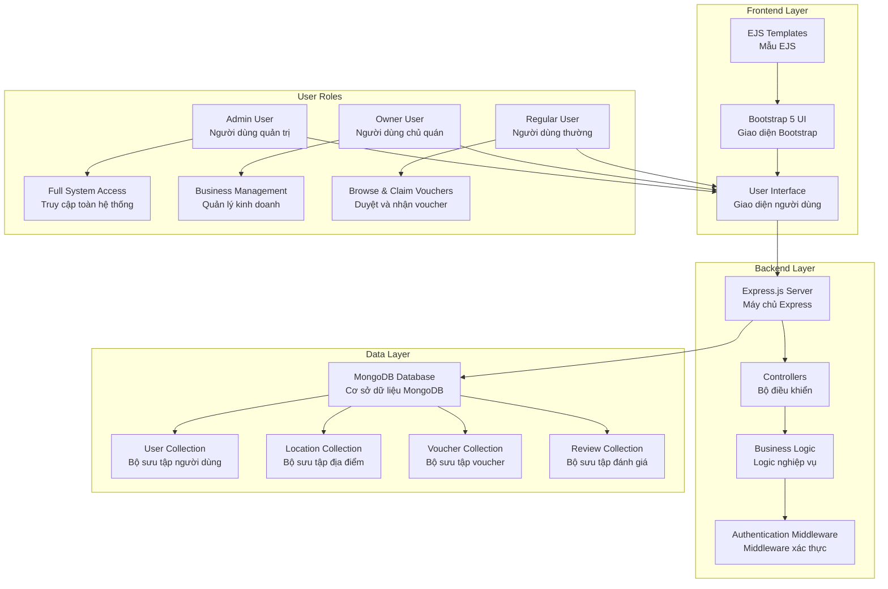
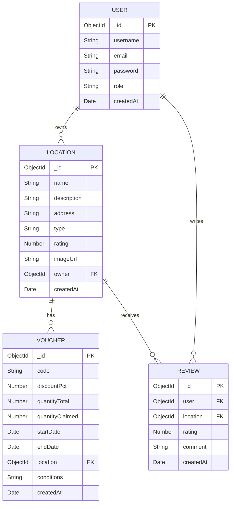
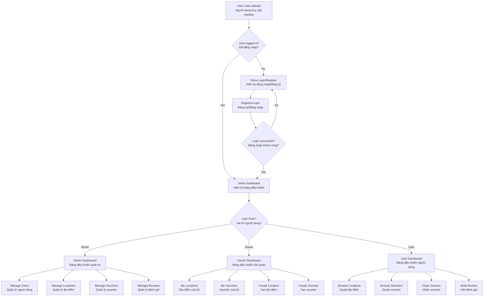
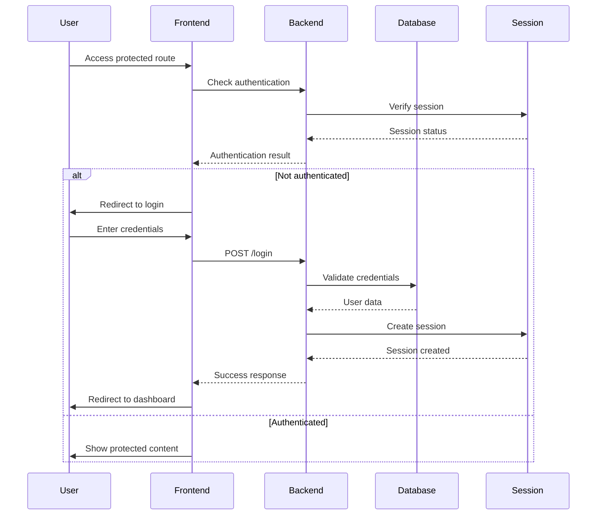
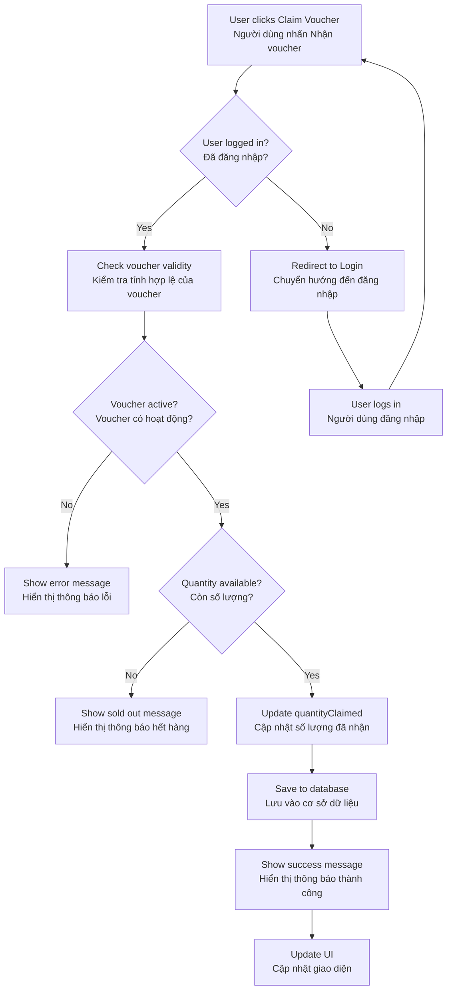
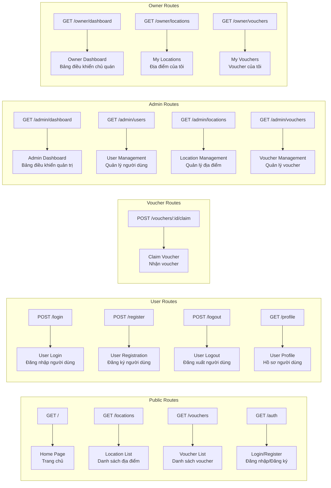

# Voucher Management System - System Architecture

## 1. System Overview Diagram (Sơ đồ tổng quan hệ thống)

## 2. Database Schema Diagram (Sơ đồ cấu trúc cơ sở dữ liệu)

## 3. User Flow Diagram (Sơ đồ luồng người dùng)

## 4. Component Architecture Diagram (Sơ đồ kiến trúc component)

```mermaid
graph TB
    subgraph "Presentation Layer"
        A["Home Page<br/>Trang chủ"] --> B["Location Detail<br/>Chi tiết địa điểm"]
        A --> C["Voucher List<br/>Danh sách voucher"]
        A --> D["Login/Register<br/>Đăng nhập/Đăng ký"]
        A --> E["User Profile<br/>Hồ sơ người dùng"]
    end
    
    subgraph "Admin Interface"
        F["Admin Dashboard<br/>Bảng điều khiển quản trị"] --> G["User Management<br/>Quản lý người dùng"]
        F --> H["Location Management<br/>Quản lý địa điểm"]
        F --> I["Voucher Management<br/>Quản lý voucher"]
        F --> J["Review Management<br/>Quản lý đánh giá"]
    end
    
    subgraph "Owner Interface"
        K["Owner Dashboard<br/>Bảng điều khiển chủ quán"] --> L["My Locations<br/>Địa điểm của tôi"]
        K --> M["My Vouchers<br/>Voucher của tôi"]
        K --> N["Create Location<br/>Tạo địa điểm"]
        K --> O["Create Voucher<br/>Tạo voucher"]
    end
    
    subgraph "Business Logic Layer"
        P["User Controller<br/>Bộ điều khiển người dùng"] --> Q["Authentication<br/>Xác thực"]
        R["Location Controller<br/>Bộ điều khiển địa điểm"] --> S["CRUD Operations<br/>Thao tác CRUD"]
        T["Voucher Controller<br/>Bộ điều khiển voucher"] --> U["Claim Logic<br/>Logic nhận voucher"]
        V["Review Controller<br/>Bộ điều khiển đánh giá"] --> W["Rating System<br/>Hệ thống đánh giá"]
    end
    
    subgraph "Data Access Layer"
        X["User Model<br/>Mô hình người dùng"] --> Y["User Schema<br/>Lược đồ người dùng"]
        Z["Location Model<br/>Mô hình địa điểm"] --> AA["Location Schema<br/>Lược đồ địa điểm"]
        BB["Voucher Model<br/>Mô hình voucher"] --> CC["Voucher Schema<br/>Lược đồ voucher"]
        DD["Review Model<br/>Mô hình đánh giá"] --> EE["Review Schema<br/>Lược đồ đánh giá"]
    end
    
    A --> P
    F --> P
    K --> R
    P --> X
    R --> Z
    T --> BB
    V --> DD
```

## 5. Authentication Flow Diagram (Sơ đồ luồng xác thực)

## 6. Voucher Claim Process Diagram (Sơ đồ quy trình nhận voucher)

## 7. File Structure Diagram (Sơ đồ cấu trúc thư mục)

```mermaid
graph TD
    A["Project Root<br/>Thư mục gốc"] --> B["src/<br/>Mã nguồn"]
    A --> C["package.json<br/>Cấu hình dự án"]
    A --> D["README.md<br/>Tài liệu"]
    A --> E[".gitignore<br/>Bỏ qua Git"]
    
    B --> F["models/<br/>Mô hình"]
    B --> G["controllers/<br/>Bộ điều khiển"]
    B --> H["routes/<br/>Định tuyến"]
    B --> I["views/<br/>Giao diện"]
    B --> J["middleware/<br/>Middleware"]
    B --> K["config/<br/>Cấu hình"]
    B --> L["public/<br/>Tài nguyên công khai"]
    B --> M["app.js<br/>Ứng dụng chính"]
    
    F --> N["user.model.js<br/>Mô hình người dùng"]
    F --> O["location.model.js<br/>Mô hình địa điểm"]
    F --> P["voucher.model.js<br/>Mô hình voucher"]
    F --> Q["review.model.js<br/>Mô hình đánh giá"]
    
    G --> R["user.controller.js<br/>Bộ điều khiển người dùng"]
    G --> S["location.controller.js<br/>Bộ điều khiển địa điểm"]
    G --> T["voucher.controller.js<br/>Bộ điều khiển voucher"]
    G --> U["review.controller.js<br/>Bộ điều khiển đánh giá"]
    
    H --> V["user.routes.js<br/>Định tuyến người dùng"]
    H --> W["location.routes.js<br/>Định tuyến địa điểm"]
    H --> X["voucher.routes.js<br/>Định tuyến voucher"]
    H --> Y["admin.routes.js<br/>Định tuyến quản trị"]
    
    I --> Z["pages/<br/>Trang"]
    I --> AA["admin/<br/>Quản trị"]
    I --> BB["owner/<br/>Chủ quán"]
    I --> CC["layout.ejs<br/>Bố cục"]
    
    L --> DD["css/<br/>Biểu định kiểu"]
    L --> EE["js/<br/>JavaScript"]
    L --> FF["images/<br/>Hình ảnh"]
```

## 8. API Endpoints Diagram (Sơ đồ các endpoint API)

## Cách sử dụng:

1. **Copy code Mermaid** từ các diagram trên
2. **Paste vào Mermaid editor** (mermaid.live) hoặc VS Code với Mermaid extension
3. **Render diagram** để xem kết quả
4. **Export** thành PNG/SVG nếu cần

## Các diagram này bao gồm:
- ✅ **System Architecture**: Kiến trúc tổng thể
- ✅ **Database Schema**: Cấu trúc cơ sở dữ liệu
- ✅ **User Flow**: Luồng người dùng
- ✅ **Component Architecture**: Kiến trúc component
- ✅ **Authentication Flow**: Luồng xác thực
- ✅ **Voucher Claim Process**: Quy trình claim voucher
- ✅ **File Structure**: Cấu trúc thư mục
- ✅ **API Endpoints**: Các endpoint API

Bạn có thể sử dụng các diagram này để:
- 📊 **Trình bày project** trong báo cáo
- 🔧 **Hiểu rõ kiến trúc** hệ thống
- 📝 **Tài liệu hóa** cho team
- 🎯 **Phân tích** và cải thiện hệ thống
