# Voucher Management System – Project Architecture

Tài liệu mô tả kiến trúc và cách vận hành hiện tại của hệ thống quản lý voucher được xây dựng bằng Node.js + Express + MongoDB + EJS. Nội dung được sắp xếp theo mạch thực hiện dự án: mục tiêu → use case → kiến trúc → thiết kế chi tiết → vận hành.

---

## 1. Project summary & goals
- **Mục tiêu**: cung cấp nền tảng web tập trung quản lý địa điểm, voucher và review; hỗ trợ user cuối claim ưu đãi, owner chăm sóc địa điểm, admin kiểm duyệt toàn hệ thống.
- **Định hướng triển khai**:
  - Monolith Express để tối ưu tốc độ phát triển.
  - Render server-side với EJS + Bootstrap (không framework SPA).
  - MongoDB làm nguồn dữ liệu chính kiêm session store; file upload lưu trên disk.
- **Phạm vi tài liệu**: các thành phần phía server (`src/**`), dữ liệu (MongoDB + filesystem) và quy trình vận hành; phần UI thuần EJS/Bootstrap nên không trình bày chi tiết.

---

## 2. Personas & primary use cases

### 2.1 Actors
| Actor | Mục đích chính | Module |
| --- | --- | --- |
| User | Duyệt địa điểm, claim voucher, viết review | `views/pages`, `voucher.controller`, `review.controller` |
| Owner | Quản lý địa điểm/voucher thuộc sở hữu, theo dõi feedback | `views/owner`, `owner.controller` |
| Admin | Giám sát thống kê, quản lý dữ liệu và kiểm duyệt nội dung | `views/admin`, `admin.routes` |

### 2.2 Use case overview

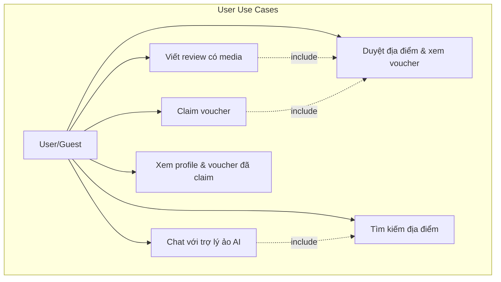
Hình 1 – Use case User

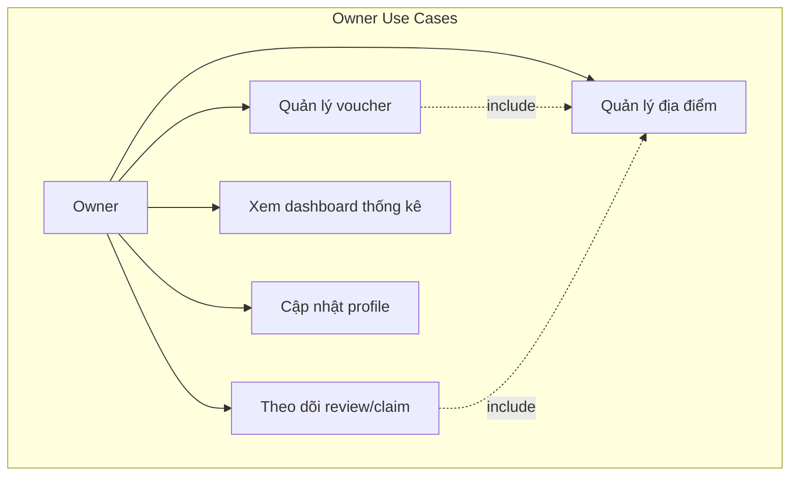
Hình 2 – Use case Owner

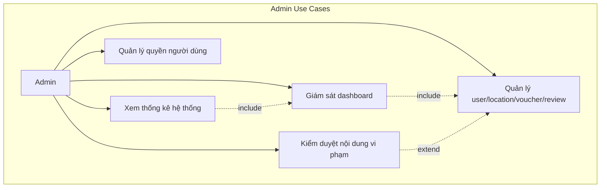
Hình 3 – Use case Admin

### 2.3 Use case tổng quát

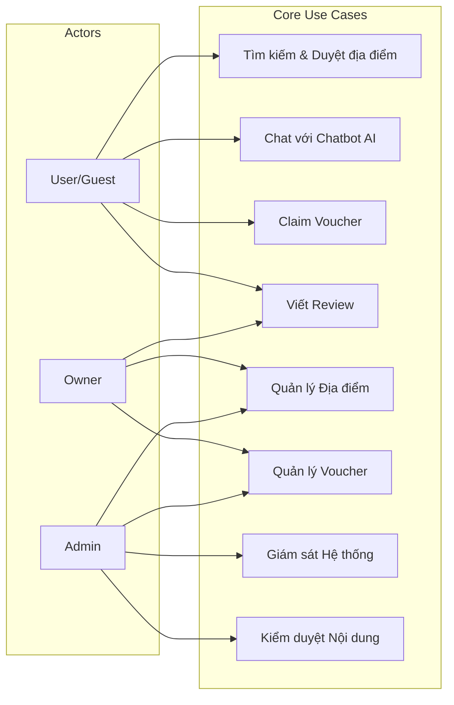
Hình 4 – Use case tổng quát hệ thống

Chi tiết từng luồng được trình bày trong phần 9.

---

## 3. Architecture overview

### 3.1 Kiến trúc tổng quan

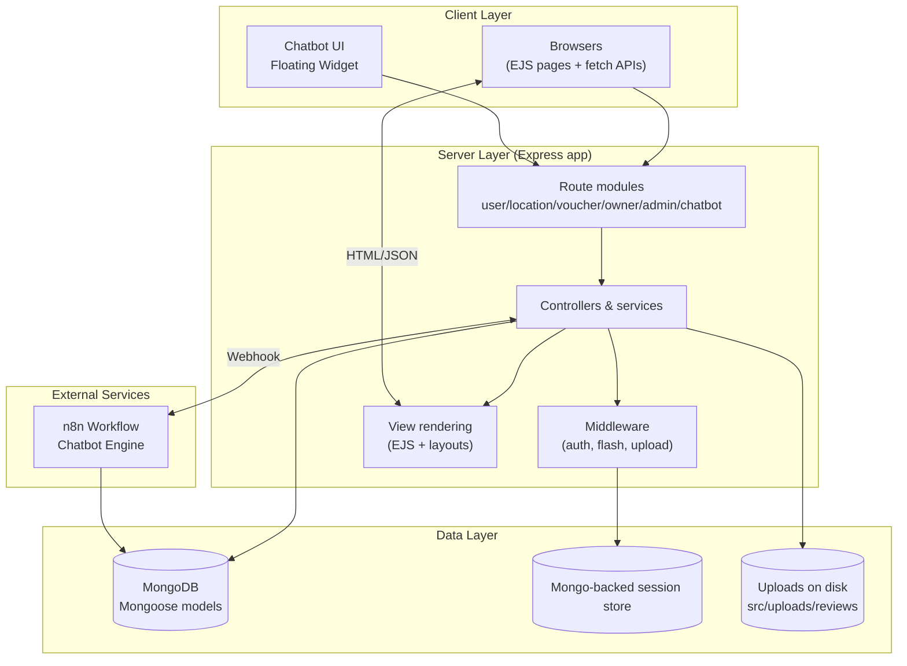
Hình 5 – Kiến trúc tổng quan hệ thống

### 3.2 Kiến trúc chi tiết theo lớp

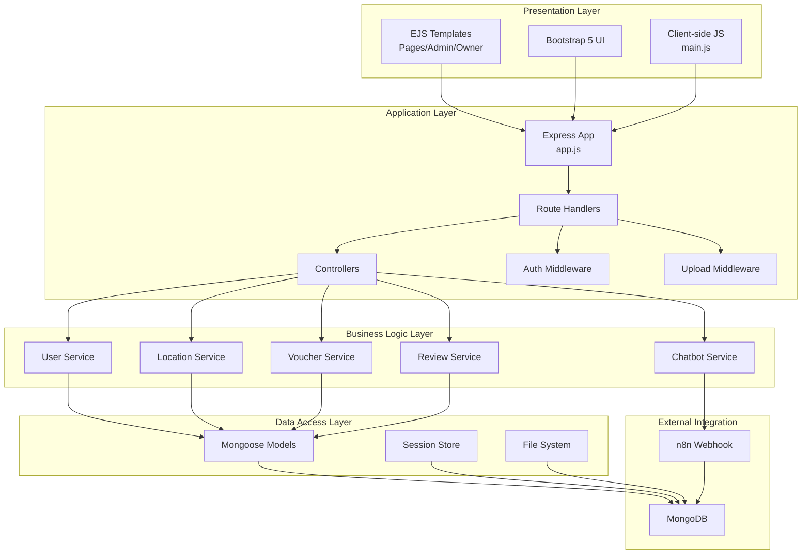
Hình 6 – Kiến trúc chi tiết theo lớp

- **Client layer**: trình duyệt tải EJS render sẵn + Bootstrap 5/Font Awesome, có một số fetch API nhẹ (claim voucher, summary).
- **Server layer**: `src/app.js` khởi tạo Express, mount routes, middleware và cấu hình layout (`express-ejs-layouts`).
- **Data layer**: MongoDB lưu toàn bộ entity và session (qua `connect-mongo`); upload review lưu ở `src/uploads`.

---

## 4. Backend components (implementation plan)

### 4.1 Application shell (`src/app.js`)
- Load env (`src/config/dotenv`), kết nối Mongo (`src/config/db.js`), boot Express.
- Middleware chuỗi: body parser, static assets (`src/public`), static uploads (`/uploads`), session + flash + `addUserToLocals`.
- Layout mặc định `views/layout.ejs`, inject metadata qua `app.locals.locationMeta`.
- Mount route modules: `/`, `userRoutes`, `locationRoutes`, `voucherRoutes`, `adminRoutes`, `ownerRoutes`.
- Handlers cho 404 + error logging.

### 4.2 Routing & controllers

| Domain | Route entry | Controller | Vai trò chính | Output |
| --- | --- | --- | --- | --- |
| Auth/Profile | `src/routes/user.routes.js` | `user.controller.js` | đăng ký/đăng nhập/logout, trang profile | `views/pages/login_register.ejs`, `pages/profile.ejs`, `owner/profile.ejs` |
| Locations | `src/routes/location.routes.js` | `location.controller.js` | danh sách/chi tiết, summary API, CRUD owner | `views/pages/locations.ejs`, `pages/location_detail.ejs`, JSON `/locations/:id/summary` |
| Reviews | `location.routes.js` + owner/admin routes | `review.controller.js` | tạo/sửa/xóa review, upload media, dashboard owner/admin | `views/pages/location_detail.ejs`, `owner/manage_review.ejs`, `admin/review_detail.ejs` |
| Vouchers | `src/routes/voucher.routes.js` | `voucher.controller.js` | list voucher, claim flow, owner CRUD | `views/pages/voucher_list.ejs`, `admin/manage_voucher.ejs` |
| Owner area | `src/routes/owner.routes.js` | `owner.controller.js` + phụ trợ | dashboard, hồ sơ, quản lý địa điểm/voucher của chính owner | `views/owner/*.ejs` |
| Admin area | `src/routes/admin.routes.js` | inline handlers + `review.controller` | dashboard thống kê, CRUD user/location/voucher/review | `views/admin/*.ejs`, JSON |

### 4.3 Middleware & session services
- `middleware/auth.js`: `requireAuth`, `requireAdmin`, `requireOwner`, `requireRole`, `redirectIfAuthenticated`, `addUserToLocals`.
- Session: `express-session` + `connect-mongo`, cookie 1 ngày, hỗ trợ bật `cookie.secure`.
- Upload: `middleware/upload.js` (multer) tạo thư mục `uploads/reviews/<userId>`, 15 MB/file, tối đa 5 file, filter ảnh/video.
- Flash message: `connect-flash` + `req.session` hỗ trợ feedback sau redirect.

### 4.4 View layer & static assets
- Layout `views/layout.ejs` bao bọc `views/pages`, `views/admin`, `views/owner`; partials dùng chung (navbar, alerts, cards).
- UI: Bootstrap 5, Font Awesome, custom CSS/JS (`src/public/css`, `src/public/js`).
- Upload phục vụ trực tiếp qua Express (`/uploads`).

### 4.5 Services & utilities
- `utils/locationMetadata.js`: chuẩn hóa feature/menu/price, remove tone, suy luận price/city/keyword; dùng trong controller và script enrich.
- Helpers trong `location.controller`: `ensureDetailedDescription`, `ensureFeatureCoverage`, builder preview.

### 4.6 Support scripts & tooling
- `src/config/db.js`: helper kết nối Mongo (app & scripts).
- `src/config/migrate.js`: thêm `phoneNumber`/`idName` cho user cũ.
- `src/config/enrich_locations.js`: enrich metadata location (hỗ trợ `--dry`).
- npm scripts: `npm run dev`, `start`, `migrate`, `enrich:locations[:dry]`, `seed`.

---

## 5. Data model & storage

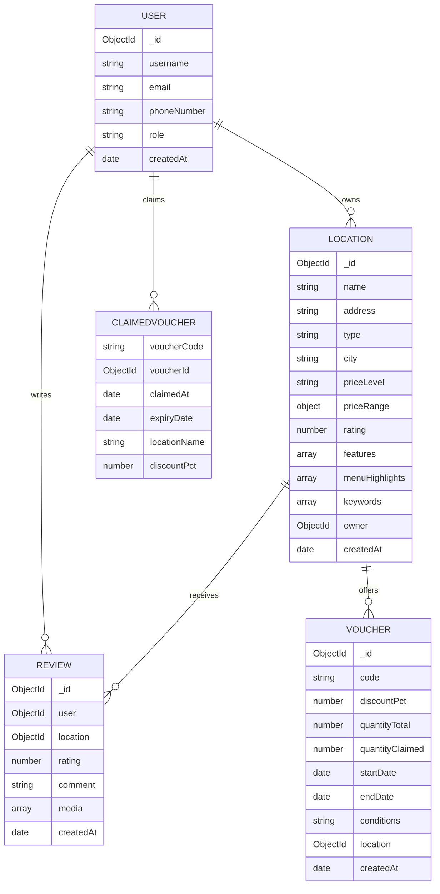

| Store | Fields chính | Index/Constraint | Ghi chú |
| --- | --- | --- | --- |
| `users` | `username`, `email`, `phoneNumber`, `role`, `claimedVouchers[]` | Unique `username/email/phoneNumber`; bcrypt hash trong `pre('save')` | Session lưu `_id`, `role`, `username`; dọn `claimedVouchers` khi hết hạn |
| `locations` | `name`, `description`, `address`, `type`, `city`, `priceLevel`, `features`, `menuHighlights`, `keywords`, `owner`, `rating` | Text index `name/description/address/city/keywords`; index `owner` | Metadata chuẩn hóa giúp search + dashboard ổn định |
| `vouchers` | `code`, `discountPct`, `quantityTotal/Claimed`, `startDate/endDate`, `location`, `conditions` | Index `code`, `location`, `startDate`, `endDate` | Có virtual `quantityRemaining`, `status`; owner CRUD kiểm tra ownership |
| `reviews` | `user`, `location`, `rating`, `comment`, `media[]` | Unique `(user, location)`; index `location`, `createdAt` | `media[]` lưu metadata file; helper xóa file khi review bị xóa |
| Filesystem uploads | `src/uploads/reviews/<userId>/<filename>` | Dir per user | Cần backup vì chứa bằng chứng tương tác |

---

## 6. Key request flows

### 6.1 Session authentication

- Fail case: flash error, redirect `/auth?tab=login`.
- Success: redirect theo role (`/admin/dashboard`, `/owner/dashboard`, `/`).

### 6.2 Voucher claim flow
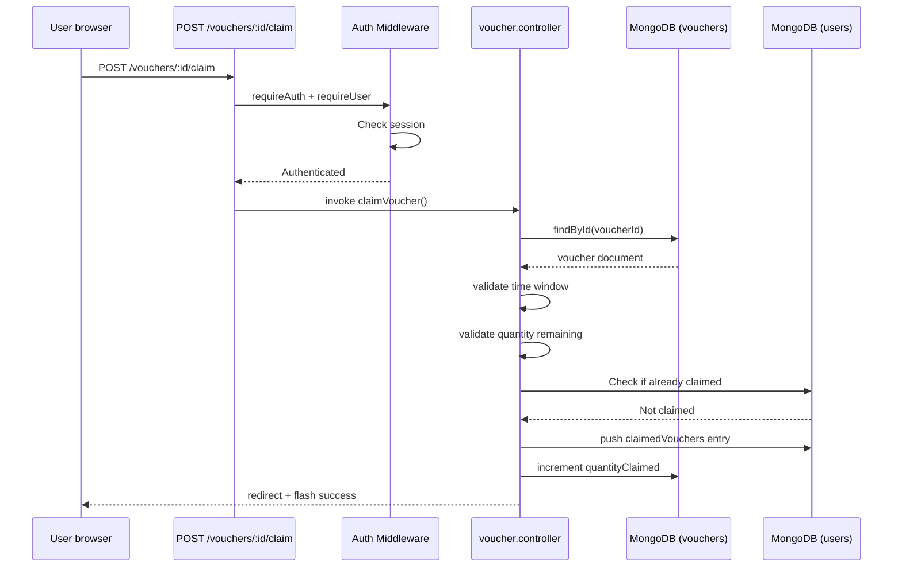
Hình 7 – Luồng claim voucher

### 6.3 Chatbot flow (n8n integration)
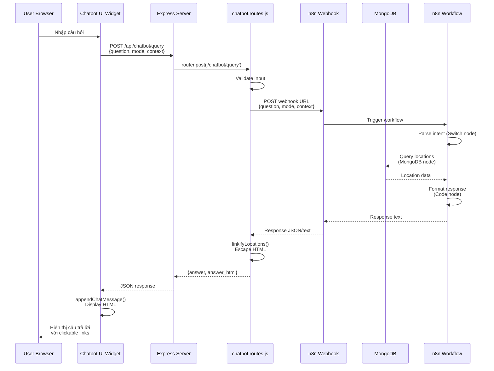
Hình 8 – Luồng xử lý Chatbot với n8n

### 6.4 Review creation flow
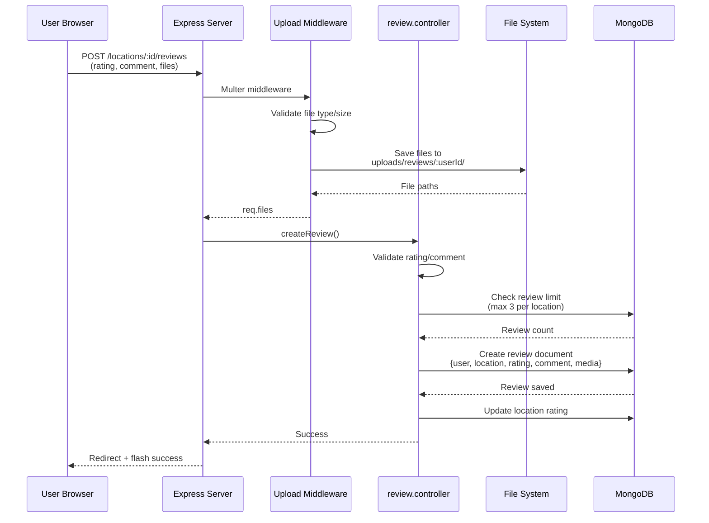
Hình 9 – Luồng tạo review với media upload

---

## 7. Cross-cutting concerns
- **Authentication & RBAC**: session-based auth (`express-session`); middleware bảo vệ route owner/admin/claim/review; logout hủy session server-side.
- **Validation & messaging**: validate dữ liệu (password, phone, `DESCRIPTION_MIN_LENGTH`, `FEATURE_MIN_COUNT`), flash message + highlight tab hỗ trợ UX.
- **Security & privacy**: bcrypt hash password, session secret mạnh, upload đặt tên an toàn (`sanitizeFilename`) + kiểm tra MIME; owner/admin không thao tác entity không thuộc quyền.
- **Search & discovery**: text index trên `locations`; metadata builder chuẩn hóa feature/menu để filter.
- **File/media handling**: lưu review media trên disk, `removeReviewMedia` dọn file khi review xóa; giới hạn dung lượng & số file.
- **Error handling & resiliency**: try/catch toàn bộ controller, trả về trang thân thiện; script enrich hỗ trợ `--dry` tránh hỏng dữ liệu.

---

## 8. Deployment & environment
- **Environment variables**: `NODE_ENV`, `PORT` (3000), `MONGODB_URI`, `SESSION_SECRET` (đọc từ `src/config/dotenv`).
- **Process**: dev dùng `npm run dev` (nodemon), prod `npm start`; triển khai nên dùng PM2/systemd.
- **Data ops**: `npm run migrate` đồng bộ schema user cũ; `npm run enrich:locations[:dry]` chuẩn hóa metadata; `npm run seed` nạp demo data.
- **Storage**: MongoDB lưu data + session (có thể tách URI), `src/uploads` phải tồn tại & backup.
- **Observability**: log `console.log/error` theo module; đề xuất chuyển sang Winston/Pino + metrics (voucher active, review rate).
- **Hardening**: bật HTTPS + `cookie.secure`, thêm CSRF token cho form quan trọng, rate-limit API public, cân nhắc CDN/static host cho `public`.

---

## 9. Detailed use case flows

### 9.1 User duyệt địa điểm & claim voucher
1. User mở `/locations`; controller query Mongo với text search + metadata filter.
2. Trang chi tiết render location + review + voucher hợp lệ.
3. User chọn claim → `POST /vouchers/:id/claim` (có `requireAuth`); controller kiểm tra thời gian, số lượng, tránh claim trùng.
4. Voucher ghi vào `claimedVouchers[]`, tăng `quantityClaimed`, flash success.

### 9.2 Owner quản lý địa điểm & voucher
1. Owner đăng nhập, truy cập `/owner/dashboard` (guard `requireOwner`).
2. Tạo/cập nhật địa điểm via `owner/manage_location`; controller validate mô tả, enrich metadata (`utils/locationMetadata`) rồi lưu.
3. Tạo voucher mới tại `owner/manage_voucher`, set `quantity`, `startDate`, `endDate`, `conditions`; controller xác thực ownership location.
4. Dashboard hiển thị bảng review & claim liên quan tới địa điểm của owner.

### 9.3 Admin giám sát hệ thống
1. Admin đăng nhập, vào `/admin/dashboard` (guard `requireAdmin`).
2. Xem thống kê tổng quan và truy cập từng module quản lý (`views/admin/*.ejs`).
3. Có thể khóa user, xóa/chỉnh sửa location/voucher/review khi phát hiện bất thường; cập nhật trực tiếp collection MongoDB.
4. Các API thống kê nhỏ được bảo vệ RBAC và chỉ dùng nội bộ EJS dashboard.

### 9.4 Review lifecycle với media
1. User/owner truy cập trang review của địa điểm; khi submit review, `middleware/upload` lưu media vào `src/uploads/reviews/<userId>`.
2. `review.controller` validate rating/comment, gắn metadata review + media.
3. Khi review bị xóa (owner/admin), `removeReviewMedia` dọn file vật lý tránh rác.
4. Review xuất hiện trên trang location, owner dashboard và admin module để phản hồi chất lượng dịch vụ.

---

## 10. Activity Diagrams

Các sơ đồ Activity mô tả chi tiết các luồng nghiệp vụ chính từ góc nhìn hành động và quyết định.

### 10.1 Activity: Đăng nhập và Đăng ký

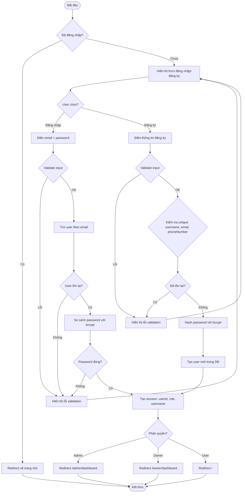
Hình 10 – Activity: Đăng nhập và Đăng ký

### 10.2 Activity: Claim Voucher

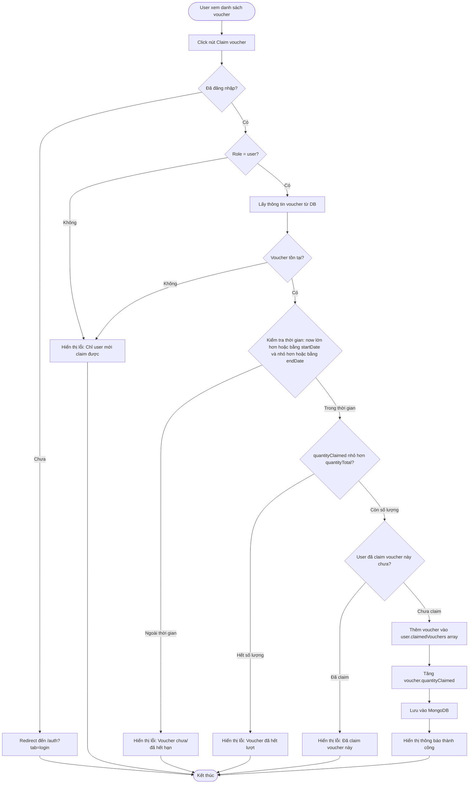
Hình 11 – Activity: Claim Voucher

### 10.3 Activity: Tạo Review với Media Upload

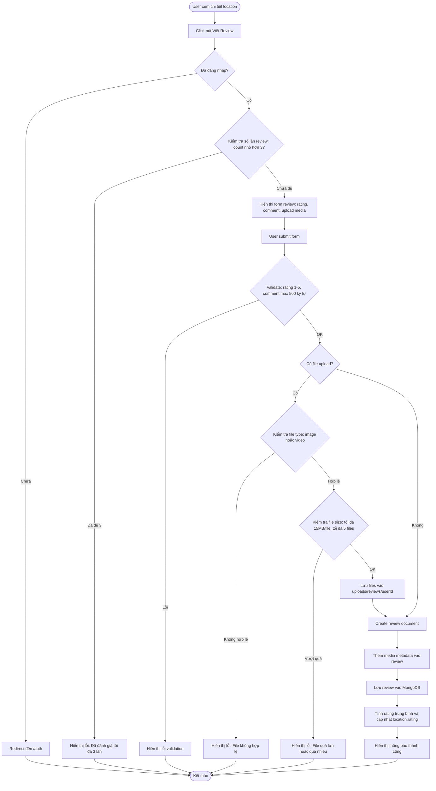
Hình 12 – Activity: Tạo Review với Media Upload

### 10.4 Activity: Owner tạo Location mới

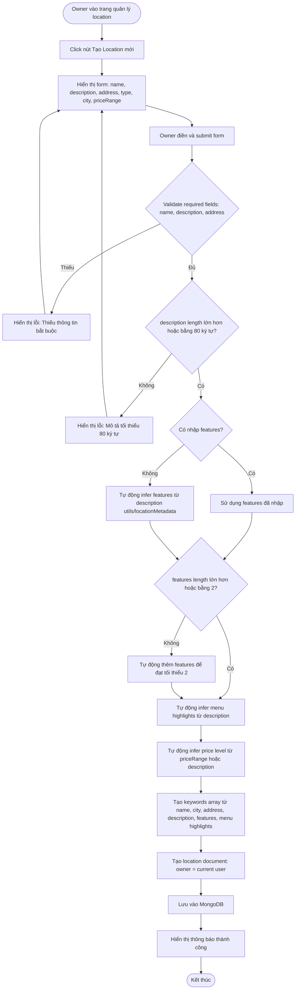
Hình 13 – Activity: Owner tạo Location mới

### 10.5 Activity: Owner tạo Voucher

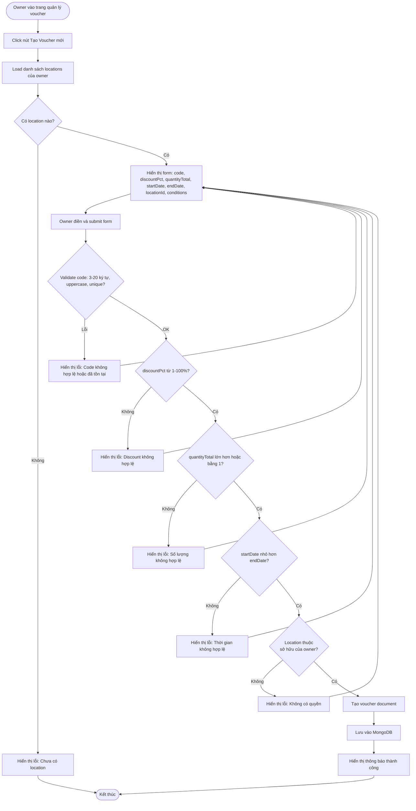
Hình 14 – Activity: Owner tạo Voucher

### 10.6 Activity: Chatbot Query Flow

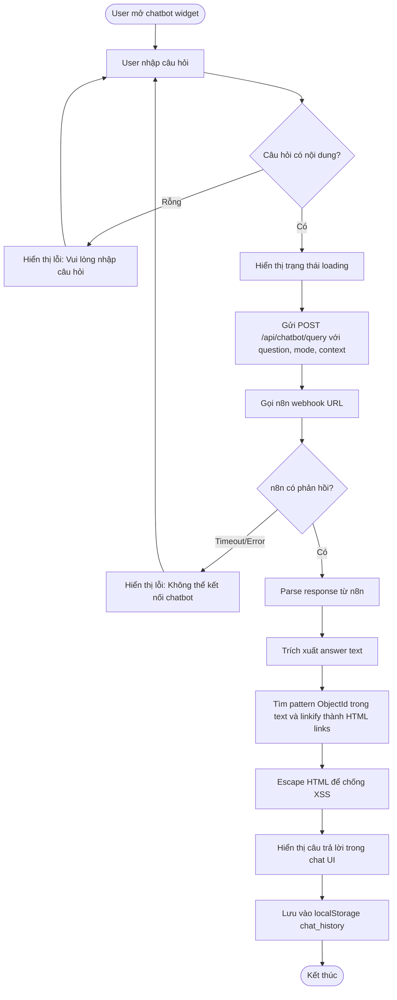
Hình 15 – Activity: Chatbot Query Flow

### 10.7 Activity: Admin quản lý User

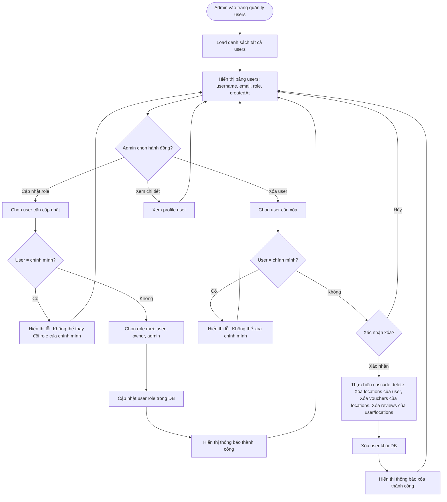
Hình 16 – Activity: Admin quản lý User

### 10.8 Activity: Tìm kiếm Location

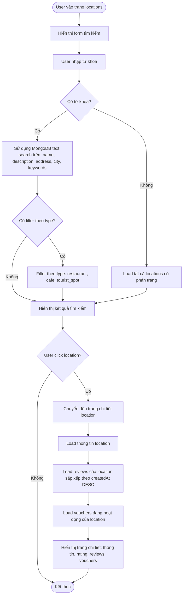
Hình 17 – Activity: Tìm kiếm Location