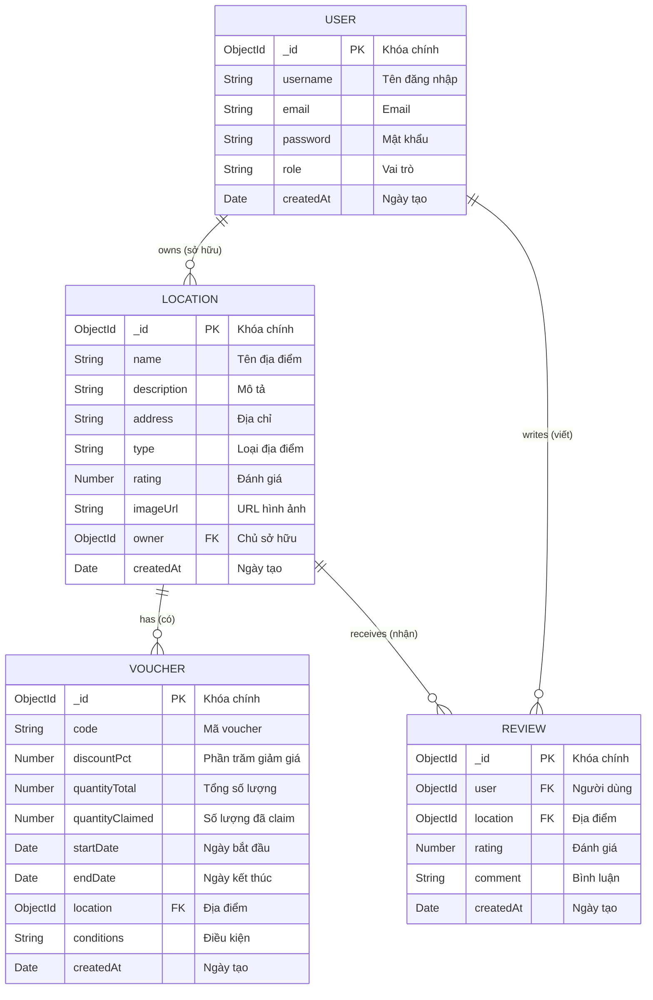
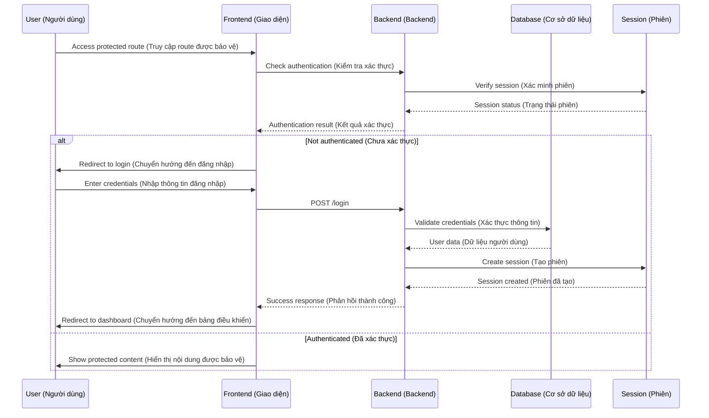

# Voucher Management System - System Architecture

## 1. System Overview Diagram (Sơ đồ tổng quan hệ thống)

```mermaid
graph TB
    subgraph "Frontend Layer (Lớp giao diện)"
        A[EJS Templates (Mẫu EJS)] --> B[Bootstrap 5 UI (Giao diện Bootstrap)]
        B --> C[User Interface (Giao diện người dùng)]
    end
    
    subgraph "Backend Layer (Lớp backend)"
        D[Express.js Server (Máy chủ Express)] --> E[Controllers (Bộ điều khiển)]
        E --> F[Business Logic (Logic nghiệp vụ)]
        F --> G[Authentication Middleware (Middleware xác thực)]
    end
    
    subgraph "Data Layer (Lớp dữ liệu)"
        H[MongoDB Database (Cơ sở dữ liệu MongoDB)] --> I[User Collection (Bộ sưu tập người dùng)]
        H --> J[Location Collection (Bộ sưu tập địa điểm)]
        H --> K[Voucher Collection (Bộ sưu tập voucher)]
        H --> L[Review Collection (Bộ sưu tập đánh giá)]
    end
    
    subgraph "User Roles (Vai trò người dùng)"
        M[Admin User (Người dùng quản trị)] --> N[Full System Access (Truy cập toàn hệ thống)]
        O[Owner User (Người dùng chủ quán)] --> P[Business Management (Quản lý kinh doanh)]
        Q[Regular User (Người dùng thường)] --> R[Browse & Claim Vouchers (Duyệt và nhận voucher)]
    end
    
    C --> D
    D --> H
    M --> C
    O --> C
    Q --> C
```

## 2. Database Schema Diagram (Sơ đồ cấu trúc cơ sở dữ liệu)



## 3. User Flow Diagram (Sơ đồ luồng người dùng)

```mermaid
flowchart TD
    A[User visits website (Người dùng truy cập website)] --> B{User logged in? (Đã đăng nhập?)}
    B -->|No| C[Show Login/Register (Hiển thị đăng nhập/đăng ký)]
    B -->|Yes| D[Show Dashboard (Hiển thị bảng điều khiển)]
    
    C --> E[Register/Login (Đăng ký/Đăng nhập)]
    E --> F{Login successful? (Đăng nhập thành công?)}
    F -->|No| C
    F -->|Yes| D
    
    D --> G{User Role? (Vai trò người dùng?)}
    G -->|Admin| H[Admin Dashboard (Bảng điều khiển quản trị)]
    G -->|Owner| I[Owner Dashboard (Bảng điều khiển chủ quán)]
    G -->|User| J[User Dashboard (Bảng điều khiển người dùng)]
    
    H --> K[Manage Users (Quản lý người dùng)]
    H --> L[Manage Locations (Quản lý địa điểm)]
    H --> M[Manage Vouchers (Quản lý voucher)]
    H --> N[Manage Reviews (Quản lý đánh giá)]
    
    I --> O[My Locations (Địa điểm của tôi)]
    I --> P[My Vouchers (Voucher của tôi)]
    I --> Q[Create Location (Tạo địa điểm)]
    I --> R[Create Voucher (Tạo voucher)]
    
    J --> S[Browse Locations (Duyệt địa điểm)]
    J --> T[Browse Vouchers (Duyệt voucher)]
    J --> U[Claim Voucher (Nhận voucher)]
    J --> V[Write Review (Viết đánh giá)]
```

## 4. Component Architecture Diagram (Sơ đồ kiến trúc component)

```mermaid
graph TB
    subgraph "Presentation Layer (Lớp trình bày)"
        A[Home Page (Trang chủ)] --> B[Location Detail (Chi tiết địa điểm)]
        A --> C[Voucher List (Danh sách voucher)]
        A --> D[Login/Register (Đăng nhập/Đăng ký)]
        A --> E[User Profile (Hồ sơ người dùng)]
    end
    
    subgraph "Admin Interface (Giao diện quản trị)"
        F[Admin Dashboard (Bảng điều khiển quản trị)] --> G[User Management (Quản lý người dùng)]
        F --> H[Location Management (Quản lý địa điểm)]
        F --> I[Voucher Management (Quản lý voucher)]
        F --> J[Review Management (Quản lý đánh giá)]
    end
    
    subgraph "Owner Interface (Giao diện chủ quán)"
        K[Owner Dashboard (Bảng điều khiển chủ quán)] --> L[My Locations (Địa điểm của tôi)]
        K --> M[My Vouchers (Voucher của tôi)]
        K --> N[Create Location (Tạo địa điểm)]
        K --> O[Create Voucher (Tạo voucher)]
    end
    
    subgraph "Business Logic Layer (Lớp logic nghiệp vụ)"
        P[User Controller (Bộ điều khiển người dùng)] --> Q[Authentication (Xác thực)]
        R[Location Controller (Bộ điều khiển địa điểm)] --> S[CRUD Operations (Thao tác CRUD)]
        T[Voucher Controller (Bộ điều khiển voucher)] --> U[Claim Logic (Logic nhận voucher)]
        V[Review Controller (Bộ điều khiển đánh giá)] --> W[Rating System (Hệ thống đánh giá)]
    end
    
    subgraph "Data Access Layer (Lớp truy cập dữ liệu)"
        X[User Model (Mô hình người dùng)] --> Y[User Schema (Lược đồ người dùng)]
        Z[Location Model (Mô hình địa điểm)] --> AA[Location Schema (Lược đồ địa điểm)]
        BB[Voucher Model (Mô hình voucher)] --> CC[Voucher Schema (Lược đồ voucher)]
        DD[Review Model (Mô hình đánh giá)] --> EE[Review Schema (Lược đồ đánh giá)]
    end
    
    A --> P
    F --> P
    K --> R
    P --> X
    R --> Z
    T --> BB
    V --> DD
```

## 5. Authentication Flow Diagram (Sơ đồ luồng xác thực)



## 6. Voucher Claim Process Diagram (Sơ đồ quy trình nhận voucher)

```mermaid
flowchart TD
    A[User clicks Claim Voucher (Người dùng nhấn Nhận voucher)] --> B{User logged in? (Đã đăng nhập?)}
    B -->|No| C[Redirect to Login (Chuyển hướng đến đăng nhập)]
    B -->|Yes| D[Check voucher validity (Kiểm tra tính hợp lệ của voucher)]
    
    D --> E{Voucher active? (Voucher có hoạt động?)}
    E -->|No| F[Show error message (Hiển thị thông báo lỗi)]
    E -->|Yes| G{Quantity available? (Còn số lượng?)}
    
    G -->|No| H[Show sold out message (Hiển thị thông báo hết hàng)]
    G -->|Yes| I[Update quantityClaimed (Cập nhật số lượng đã nhận)]
    
    I --> J[Save to database (Lưu vào cơ sở dữ liệu)]
    J --> K[Show success message (Hiển thị thông báo thành công)]
    K --> L[Update UI (Cập nhật giao diện)]
    
    C --> M[User logs in (Người dùng đăng nhập)]
    M --> A
```

## 7. File Structure Diagram (Sơ đồ cấu trúc thư mục)

```mermaid
graph TD
    A[Project Root (Thư mục gốc)] --> B[src/ (Mã nguồn)]
    A --> C[package.json (Cấu hình dự án)]
    A --> D[README.md (Tài liệu)]
    A --> E[.gitignore (Bỏ qua Git)]
    
    B --> F[models/ (Mô hình)]
    B --> G[controllers/ (Bộ điều khiển)]
    B --> H[routes/ (Định tuyến)]
    B --> I[views/ (Giao diện)]
    B --> J[middleware/ (Middleware)]
    B --> K[config/ (Cấu hình)]
    B --> L[public/ (Tài nguyên công khai)]
    B --> M[app.js (Ứng dụng chính)]
    
    F --> N[user.model.js (Mô hình người dùng)]
    F --> O[location.model.js (Mô hình địa điểm)]
    F --> P[voucher.model.js (Mô hình voucher)]
    F --> Q[review.model.js (Mô hình đánh giá)]
    
    G --> R[user.controller.js (Bộ điều khiển người dùng)]
    G --> S[location.controller.js (Bộ điều khiển địa điểm)]
    G --> T[voucher.controller.js (Bộ điều khiển voucher)]
    G --> U[review.controller.js (Bộ điều khiển đánh giá)]
    
    H --> V[user.routes.js (Định tuyến người dùng)]
    H --> W[location.routes.js (Định tuyến địa điểm)]
    H --> X[voucher.routes.js (Định tuyến voucher)]
    H --> Y[admin.routes.js (Định tuyến quản trị)]
    
    I --> Z[pages/ (Trang)]
    I --> AA[admin/ (Quản trị)]
    I --> BB[owner/ (Chủ quán)]
    I --> CC[layout.ejs (Bố cục)]
    
    L --> DD[css/ (Biểu định kiểu)]
    L --> EE[js/ (JavaScript)]
    L --> FF[images/ (Hình ảnh)]
```

## 8. API Endpoints Diagram (Sơ đồ các endpoint API)

```mermaid
graph LR
    subgraph "Public Routes (Route công khai)"
        A[GET /] --> B[Home Page (Trang chủ)]
        C[GET /locations] --> D[Location List (Danh sách địa điểm)]
        E[GET /vouchers] --> F[Voucher List (Danh sách voucher)]
        G[GET /auth] --> H[Login/Register (Đăng nhập/Đăng ký)]
    end
    
    subgraph "User Routes (Route người dùng)"
        I[POST /login] --> J[User Login (Đăng nhập người dùng)]
        K[POST /register] --> L[User Registration (Đăng ký người dùng)]
        M[POST /logout] --> N[User Logout (Đăng xuất người dùng)]
        O[GET /profile] --> P[User Profile (Hồ sơ người dùng)]
    end
    
    subgraph "Voucher Routes (Route voucher)"
        Q[POST /vouchers/:id/claim] --> R[Claim Voucher (Nhận voucher)]
    end
    
    subgraph "Admin Routes (Route quản trị)"
        S[GET /admin/dashboard] --> T[Admin Dashboard (Bảng điều khiển quản trị)]
        U[GET /admin/users] --> V[User Management (Quản lý người dùng)]
        W[GET /admin/locations] --> X[Location Management (Quản lý địa điểm)]
        Y[GET /admin/vouchers] --> Z[Voucher Management (Quản lý voucher)]
    end
    
    subgraph "Owner Routes (Route chủ quán)"
        AA[GET /owner/dashboard] --> BB[Owner Dashboard (Bảng điều khiển chủ quán)]
        CC[GET /owner/locations] --> DD[My Locations (Địa điểm của tôi)]
        EE[GET /owner/vouchers] --> FF[My Vouchers (Voucher của tôi)]
    end
```

## Cách sử dụng:

1. **Copy code Mermaid** từ các diagram trên
2. **Paste vào Mermaid editor** (mermaid.live) hoặc VS Code với Mermaid extension
3. **Render diagram** để xem kết quả
4. **Export** thành PNG/SVG nếu cần

## Các diagram này bao gồm:
- ✅ **System Architecture**: Kiến trúc tổng thể
- ✅ **Database Schema**: Cấu trúc cơ sở dữ liệu
- ✅ **User Flow**: Luồng người dùng
- ✅ **Component Architecture**: Kiến trúc component
- ✅ **Authentication Flow**: Luồng xác thực
- ✅ **Voucher Claim Process**: Quy trình claim voucher
- ✅ **File Structure**: Cấu trúc thư mục
- ✅ **API Endpoints**: Các endpoint API

Bạn có thể sử dụng các diagram này để:
- 📊 **Trình bày project** trong báo cáo
- 🔧 **Hiểu rõ kiến trúc** hệ thống
- 📝 **Tài liệu hóa** cho team
- 🎯 **Phân tích** và cải thiện hệ thống
