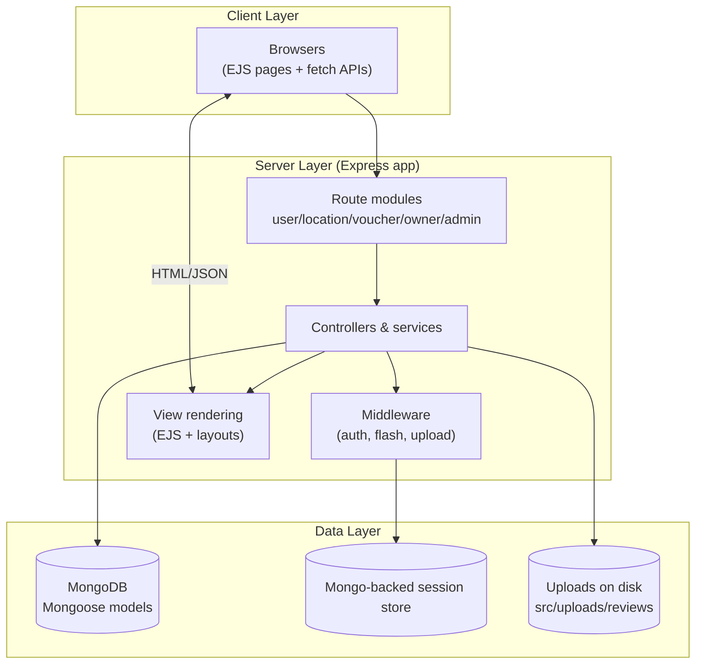
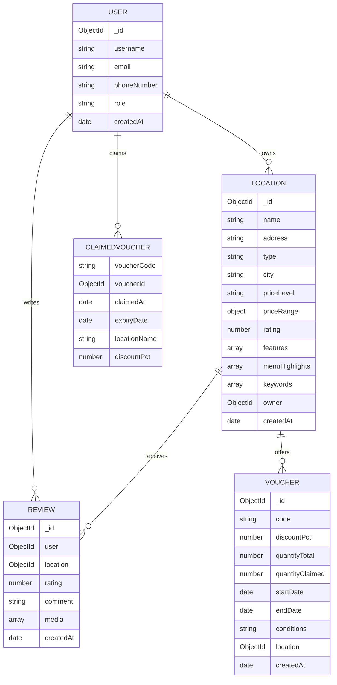
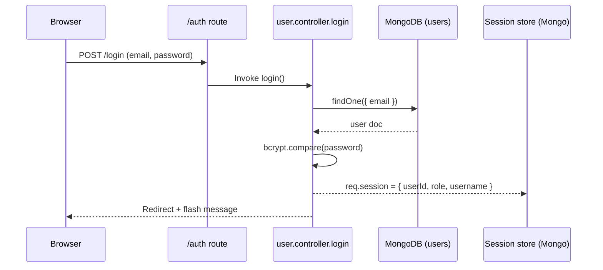
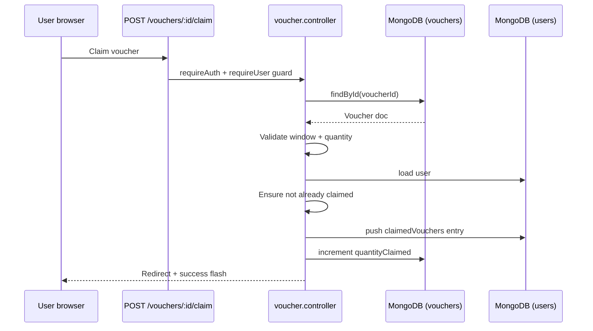
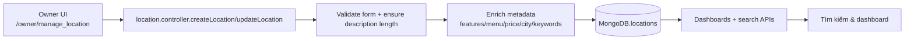

# Voucher Management System - System Architecture

Tài liệu này mô tả cấu trúc hiện tại của hệ thống quản lý voucher được xây dựng bằng Node.js, Express, MongoDB và EJS. Nội dung tập trung vào cách các lớp giao diện, dịch vụ và dữ liệu phối hợp để phục vụ admin, chủ địa điểm (owner) và người dùng cuối.

## 1. Scope & Personas (Bối cảnh & vai trò)

- Nền tảng web đơn nhất (monolith) phục vụ người dùng cuối, chủ địa điểm và admin thông qua giao diện EJS responsive.
- Admin kiểm soát toàn bộ dữ liệu (người dùng, địa điểm, voucher, review) và xem dashboard thống kê trong `views/admin`.
- Owner quản lý địa điểm, voucher và theo dõi phản hồi khách hàng trong `views/owner`.
- Regular user đăng ký/đăng nhập, duyệt địa điểm, claim voucher và gửi review có media.
- Tài liệu tập trung vào các thành phần server-side (`src/**`) và dữ liệu (MongoDB + filesystem uploads); client-side thuần EJS/Bootstrap nên không có framework riêng.

## 2. Layered Architecture Overview (Kiến trúc phân lớp)

- **Client layer**: trình duyệt tải EJS render sẵn kết hợp Bootstrap 5, Font Awesome và các fetch API nhẹ.
- **Server layer**: `src/app.js` bootstraps Express, đăng ký routes, middleware, layout engine và inject metadata (`app.locals.locationMeta`).
- **Data layer**: MongoDB lưu toàn bộ entities và đồng thời làm session store thông qua `connect-mongo`; media review được lưu trên ổ đĩa (`src/uploads`).

## 3. Runtime Components

### 3.1 Application shell (`src/app.js`)

- Nạp biến môi trường từ `src/config/dotenv`, kết nối Mongo thông qua `src/config/db.js`, sau đó khởi tạo Express.
- Chuỗi middleware chuẩn: `express.json/urlencoded`, static assets (`src/public`), static uploads (`/uploads`), session (`express-session` + `connect-mongo`), `connect-flash`, `addUserToLocals` để EJS biết thông tin người dùng hiện tại.
- Dùng `express-ejs-layouts` với layout mặc định `views/layout.ejs`; `app.locals.locationMeta` cung cấp metadata cho mọi view.
- Định tuyến: `/` hiển thị trang chủ (lấy location/voucher mới), sau đó mount `userRoutes`, `locationRoutes`, `voucherRoutes`, `adminRoutes`, `ownerRoutes`.
- Bộ xử lý 404 và lỗi tổng hợp đảm bảo trả về trang thân thiện, đồng thời log lỗi ra console.

### 3.2 Routing & domain controllers

| Domain | Route entry | Controller(s) | Responsibilities | Output |
| --- | --- | --- | --- | --- |
| Authentication & profile | `src/routes/user.routes.js` | `controllers/user.controller.js` | Render trang login/register, đăng ký, đăng nhập, logout, profile user/owner | `views/pages/login_register.ejs`, `pages/profile.ejs`, `owner/profile.ejs` |
| Locations & discovery | `src/routes/location.routes.js` | `controllers/location.controller.js` | Danh sách/chi tiết địa điểm, summary API, CRUD location cho owner | `views/pages/locations.ejs`, `pages/location_detail.ejs`, JSON API (`/locations/:id/summary`) |
| Reviews | `location.routes.js` + owner/admin routes | `controllers/review.controller.js` | Tạo/sửa/xóa review, quản lý media, dashboard review cho owner/admin | `views/pages/location_detail.ejs`, `owner/manage_review.ejs`, `admin/review_detail.ejs` |
| Vouchers | `src/routes/voucher.routes.js` | `controllers/voucher.controller.js` | List voucher đang hoạt động, user claim voucher, owner CRUD voucher, render bảng quản lý | `views/pages/voucher_list.ejs`, `admin/manage_voucher.ejs` |
| Owner area | `src/routes/owner.routes.js` | `controllers/owner.controller.js`, `user.controller`, `review.controller` | Dashboard owner, danh sách địa điểm, hồ sơ, review thuộc địa điểm của mình | `views/owner/*.ejs` |
| Admin area | `src/routes/admin.routes.js` | Inline route handlers + `review.controller` | Dashboard tổng quan, quản lý user/location/voucher/review, JSON endpoints nhỏ | `views/admin/*.ejs`, JSON |

> Các controller chia sẻ Mongoose models (`src/models/*.js`) để truy xuất dữ liệu theo domain.

### 3.3 Middleware & session services

- `middleware/auth.js` cung cấp `requireAuth`, `requireAdmin`, `requireOwner`, `requireRole`, `redirectIfAuthenticated` và `addUserToLocals`. Tất cả route nhạy cảm (owner/admin/claim voucher/review) đều sử dụng guard này.
- Session lưu trong MongoDB thông qua `connect-mongo`, cookie 1 ngày, có thể bật `cookie.secure` khi deploy HTTPS.
- `middleware/upload.js` (multer) xử lý upload media review: tạo thư mục theo `uploads/reviews/<userId>`, giới hạn 15 MB/tệp và tối đa 5 file, chỉ nhận ảnh/video.
- Flash message (`connect-flash`) + `req.session` cung cấp phản hồi người dùng nhất quán sau redirect.

### 3.4 View layer & static assets

- Layout chính `views/layout.ejs` bao bọc các trang trong `views/pages`, `views/admin`, `views/owner`, cùng partials (navbar, alerts, cards).
- UI dựa trên Bootstrap 5 + Font Awesome, CSS/JS tùy biến nằm ở `src/public/css` và `src/public/js`. Static assets được phục vụ từ `/` thông qua `express.static`.
- Upload người dùng không đi qua CDN; Express phục vụ trực tiếp thư mục `src/uploads` dưới prefix `/uploads`.

### 3.5 Services & utilities

- `utils/locationMetadata.js` chứa thư viện feature/menu/price, hàm chuẩn hóa text (remove tone), phân tích menu, suy luận price level, city, keywords. Module này được dùng trong controller, script enrich và `app.locals`.
- Helper trong `location.controller` đảm bảo mô tả/đặc điểm địa điểm đạt chuẩn trước khi ghi DB (ví dụ `ensureDetailedDescription`, `ensureFeatureCoverage`).

### 3.6 Support scripts & tooling

- `src/config/db.js`: helper kết nối Mongo (dùng bởi app và scripts).
- `src/config/migrate.js`: migration thêm `phoneNumber`/`idName` cho user thiếu dữ liệu.
- `src/config/enrich_locations.js`: chuẩn hóa & làm giàu location hiện có (feature, menu, price, city, keyword) với chế độ dry-run.
- npm scripts: `npm run dev` (nodemon), `npm start`, `npm run migrate`, `npm run enrich:locations[:dry]`, `npm run seed` (đưa dữ liệu mẫu như mô tả trong README).

## 4. Data model & storage

| Store | Important fields | Indexes/Constraints | Notes |
| --- | --- | --- | --- |
| `users` | `username`, `email`, `phoneNumber`, `role`, `claimedVouchers[]` | Unique indexes trên `username`, `email`, `phoneNumber`; bcrypt hash trong hook `pre('save')` | Session lưu `_id`, `role`, `username`; `claimedVouchers` được dọn khi hết hạn |
| `locations` | `name`, `description`, `address`, `type`, `city`, `priceLevel`, `features`, `menuHighlights`, `keywords`, `owner`, `rating` | Text index trên `name/description/address/city/keywords`; index `owner` | Metadata chuẩn hóa giúp search và dashboard thống kê hoạt động ổn định |
| `vouchers` | `code`, `discountPct`, `quantityTotal/Claimed`, `startDate/endDate`, `location`, `conditions` | Index `code`, `location`, `startDate`, `endDate` | Virtual fields `quantityRemaining`, `status`; owner CRUD kiểm tra quyền sở hữu location |
| `reviews` | `user`, `location`, `rating`, `comment`, `media[]` | Unique compound index `(user, location)`; index `location`, `createdAt` | `media[]` lưu metadata file; helper xóa file khi review bị xóa |
| Filesystem uploads | `src/uploads/reviews/<userId>/<filename>` | Directory per user; tên file đã sanitized | Đảm bảo backup vì chứa bằng chứng tương tác người dùng |

## 5. Key request flows (Luồng chính)

### 5.1 Session authentication

- Nếu xác thực thất bại, controller ghi flash error và redirect về `/auth?tab=login`.
- Tùy vai trò, user được redirect sang `/admin/dashboard`, `/owner/dashboard` hoặc `/`.

### 5.2 Voucher claim flow

- Cả user doc và voucher doc được cập nhật trong cùng request; logic đơn giản, chưa dùng transaction nhưng đủ vì số lượng claim nhỏ.

### 5.3 Owner location lifecycle

- Owner chỉ định city, price range, features; controller đảm bảo mô tả đủ dài (>= `DESCRIPTION_MIN_LENGTH`) và đủ đặc điểm (`FEATURE_MIN_COUNT`).
- Metadata được suy luận bằng `locationMetadata` để phục vụ search và thống kê.

## 6. Cross-cutting concerns (Các mối quan tâm ngang)

- **Authentication & RBAC**: session-based auth với `express-session`; middleware đảm bảo admin, owner, user truy cập đúng phạm vi. Logout hủy session server-side.
- **Data validation & messaging**: controller kiểm tra dữ liệu (ví dụ so sánh password, validate phone, enforce `DESCRIPTION_MIN_LENGTH`, `FEATURE_MIN_COUNT`). Flash message + highlight tab giúp UX rõ ràng.
- **Security & privacy**: mật khẩu hash bằng bcrypt; session secret cần cấu hình mạnh; uploads được đặt tên an toàn (`sanitizeFilename`) và kiểm soát MIME để tránh thực thi; owner/admin không thể thao tác entity không thuộc quyền.
- **Search & discovery**: `locations` có text index trên name/description/address/city/keywords; metadata builder đảm bảo feature/menu chuẩn hóa để filter.
- **File/media handling**: media review lưu trên disk và liên kết qua URL tương đối, helper `removeReviewMedia` xóa file khi review bị xóa; giới hạn kích thước và số lượng file đảm bảo tài nguyên máy chủ.
- **Error handling & resiliency**: home + controller đều wrap `try/catch` và chuyển hướng về trang phù hợp; enrichment script hỗ trợ `--dry` để tránh làm hỏng dữ liệu thật.

## 7. Deployment & environment

- **Environment variables**: `NODE_ENV`, `PORT` (mặc định 3000), `MONGODB_URI`, `SESSION_SECRET`. Tất cả được đọc từ `src/config/dotenv`.
- **Process management**: `npm run dev` dùng nodemon cho phát triển; `npm start` chạy Node thường; có thể dùng PM2/systemd để giữ tiến trình sống trong sản xuất.
- **Data operations**: `npm run migrate` đồng bộ user cũ; `npm run enrich:locations` (hoặc `--dry`) chuẩn hóa metadata; `npm run seed` nạp dữ liệu demo được mô tả trong README.
- **Persistent storage**: MongoDB lưu dữ liệu chính lẫn session store (có thể tách URI riêng nếu cần). `src/uploads` phải tồn tại và được backup khi triển khai vì chứa media người dùng.
- **Observability & logging**: log qua `console.log/error` (có prefix theo module). Khi triển khai thực tế nên chuyển sang một logger tập trung (Winston/Pino) và thêm metrics (active voucher, review rate...).
- **Hardening đề xuất**: bật HTTPS + `cookie.secure`, bổ sung CSRF token cho form quan trọng, thêm rate limit cho các API public, và cân nhắc CDN/static host cho `public` để giảm tải Express.

## 8. Use cases (Tình huống sử dụng chính)

### 8.1 User duyệt địa điểm và claim voucher

1. User truy cập `/locations` để duyệt danh sách; controller gọi MongoDB với text search + metadata filter để trả về kết quả phù hợp.
2. Khi chọn địa điểm, trang chi tiết render thông tin location, review và voucher còn hiệu lực.
3. User bấm claim trên một voucher → `POST /vouchers/:id/claim` (có `requireAuth`). Controller xác nhận thời gian hiệu lực, số lượng còn lại, và đảm bảo user chưa claim trước đó.
4. Voucher được ghi vào `claimedVouchers[]` của user, `quantityClaimed` của voucher tăng lên, flash message hiển thị trên trang kết quả.

### 8.2 Owner quản lý địa điểm và voucher

1. Owner đăng nhập và vào `/owner/dashboard`; middleware `requireOwner` đảm bảo đúng vai trò.
2. Owner tạo/cập nhật địa điểm thông qua form `owner/manage_location`. Controller kiểm tra mô tả, enrich metadata bằng `utils/locationMetadata` rồi lưu vào `locations`.
3. Owner tạo voucher mới trong `owner/manage_voucher`, thiết lập `quantity`, `startDate`, `endDate`, `conditions`. Controller xác nhận ownership của location được chọn.
4. Dashboard cung cấp bảng theo dõi claim và review liên quan đến các location mà owner sở hữu.

### 8.3 Admin giám sát hệ thống

1. Admin đăng nhập và truy cập `/admin/dashboard`. Bộ lọc `requireAdmin` đảm bảo chỉ admin vào được.
2. Từ dashboard, admin xem số liệu tổng quan (user/location/voucher/review), duyệt danh sách chi tiết trong các trang quản lý tương ứng (`views/admin/*.ejs`).
3. Admin có thể khóa user, xóa hoặc chỉnh sửa location/voucher/review khi phát hiện bất thường; mọi thao tác cập nhật trực tiếp trên các collection MongoDB.
4. Các API hỗ trợ (ví dụ JSON thống kê) được bảo vệ bởi RBAC và chủ yếu dùng bởi EJS dashboard.

### 8.4 Review lifecycle với media

1. User hoặc owner truy cập trang review thuộc địa điểm; khi gửi review mới, `middleware/upload` lưu file media vào `src/uploads/reviews/<userId>`.
2. `review.controller` validate rating/comment, cập nhật metadata review và liên kết media.
3. Khi review bị xóa (owner/admin), helper `removeReviewMedia` xóa file vật lý tương ứng để tránh rác.
4. Các review hiện diện trên trang location và trang quản lý owner/admin, hỗ trợ phản hồi chất lượng dịch vụ.